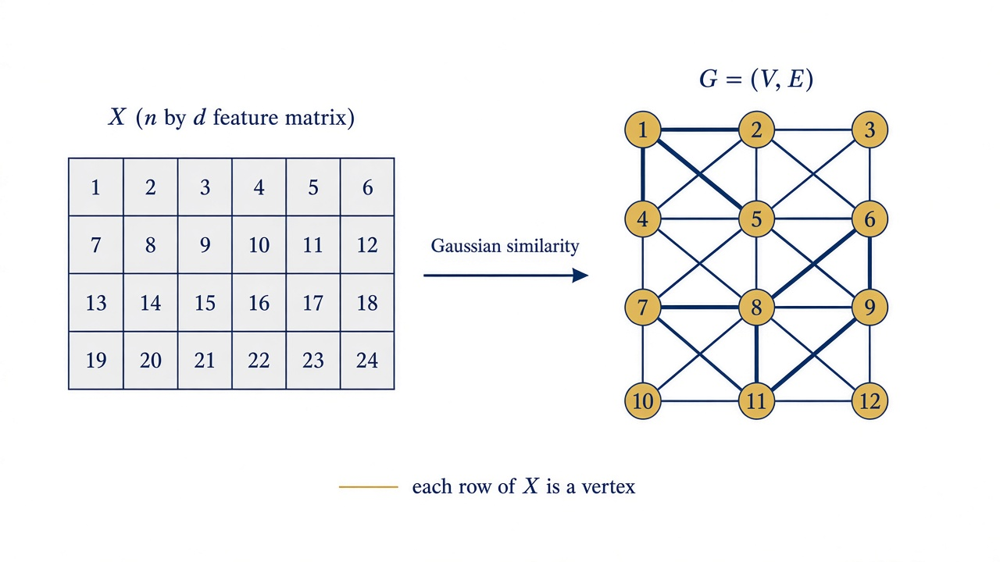
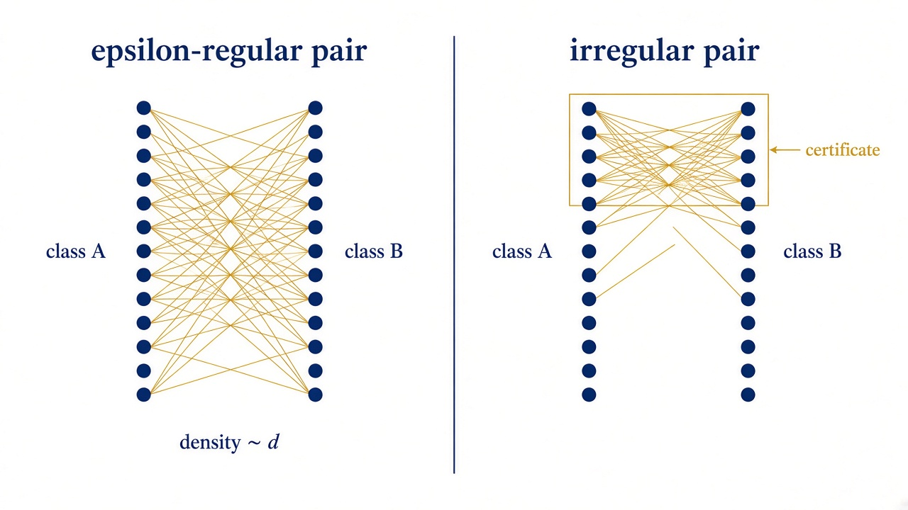
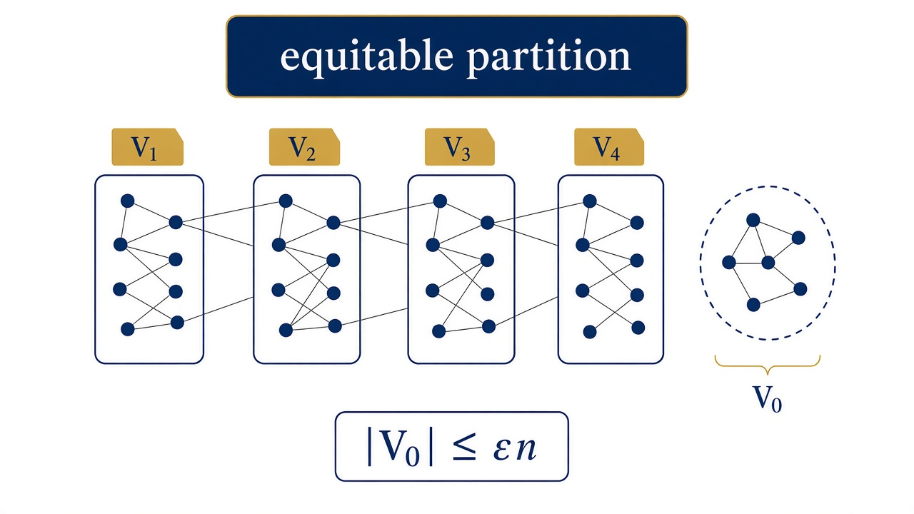
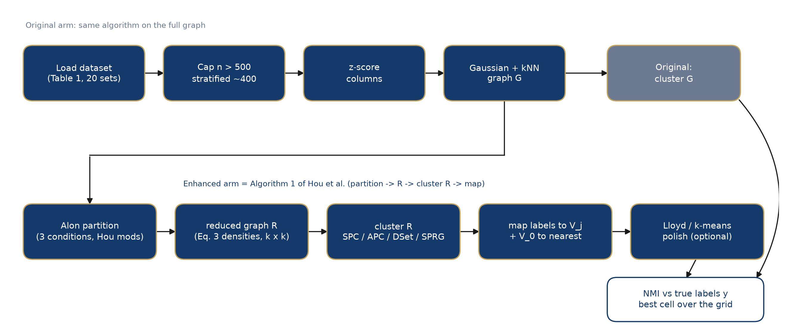
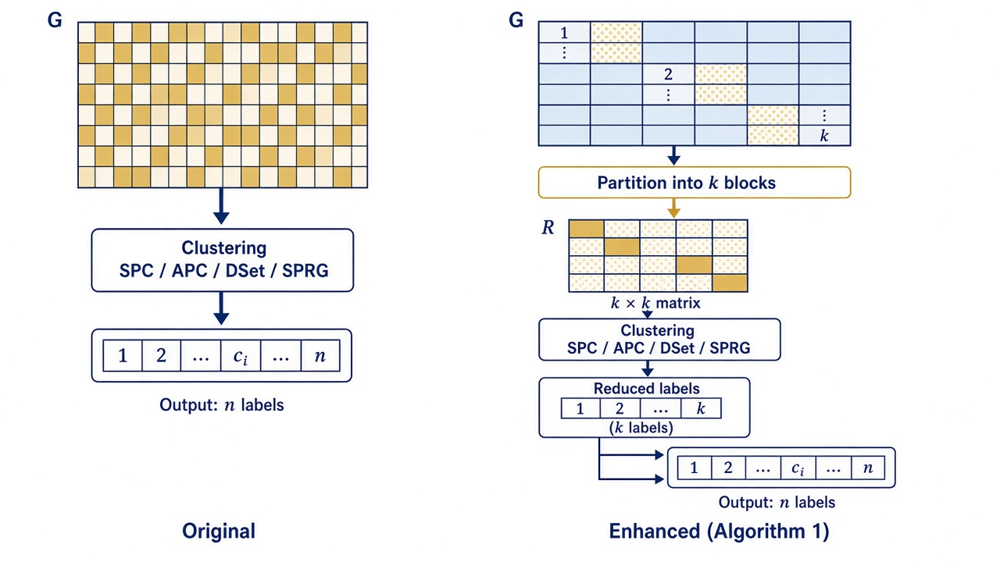
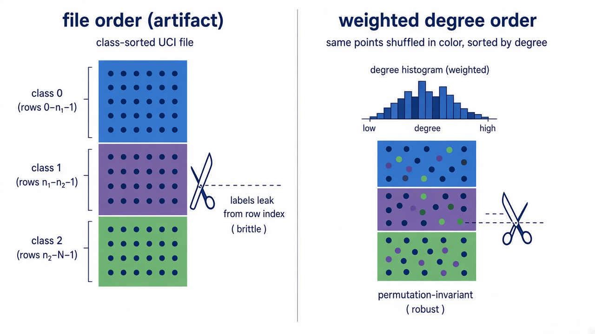
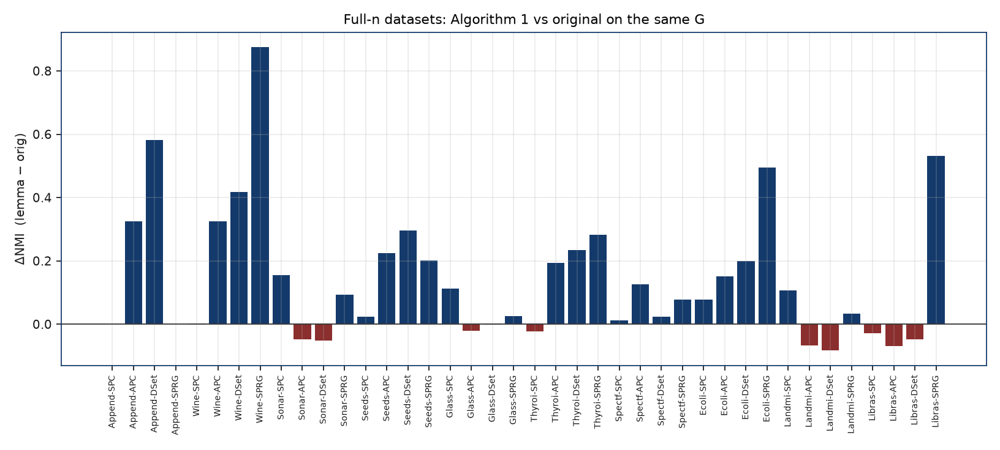
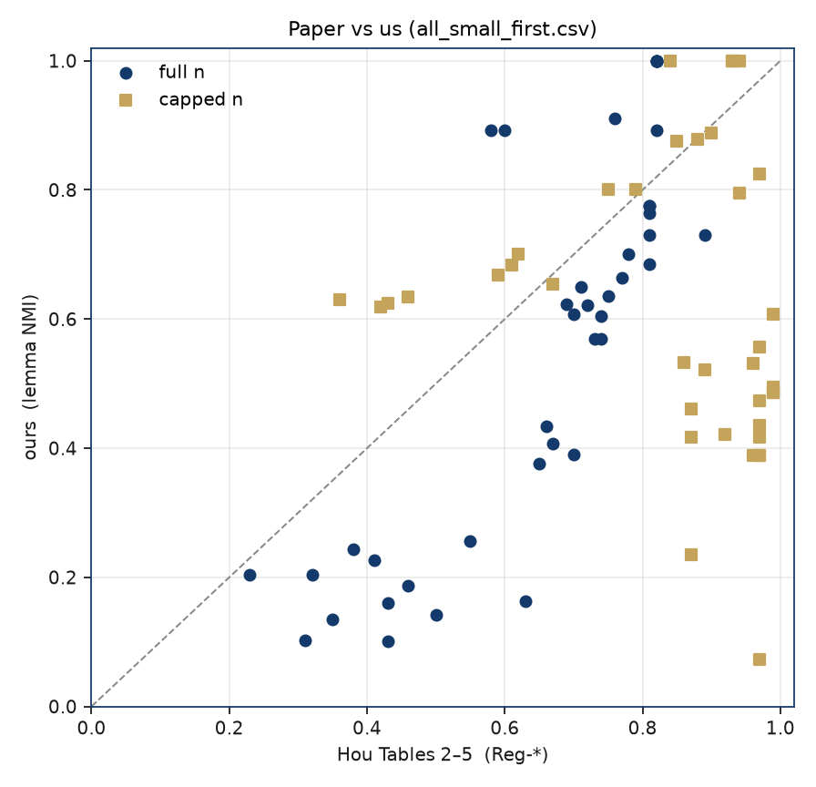
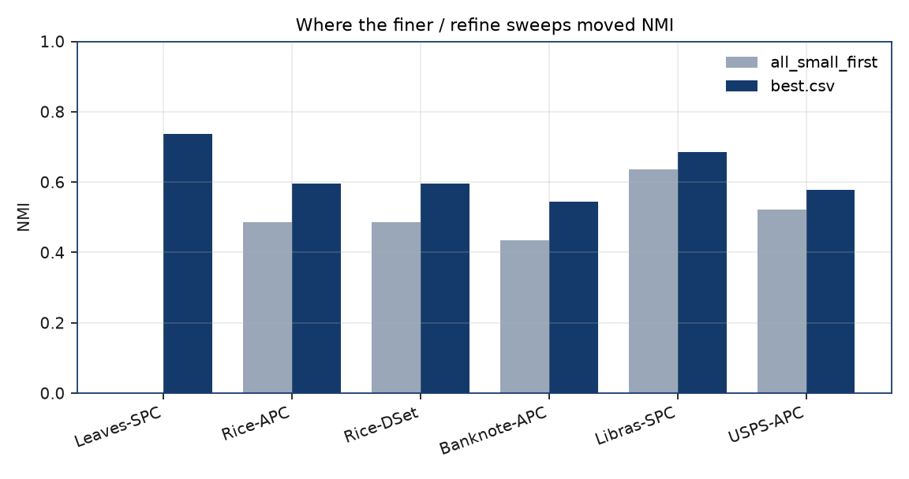

# فهرست نمادها

| نماد | معنا |
|---|---|
| \(G\) | گراف شباهت ساخته‌شده از داده‌ها |
| \(S\) | ماتریس شباهت |
| \(R\) | گراف کاهش‌یافته پس از افراز |
| \(V_0\) | مجموعه استثنایی افراز عادلانه |
| \(n\) | تعداد نمونه‌ها (رأس‌ها) |
| \(k\) | تعداد کلاس‌های افراز جاری |
| \(b\) | تعداد کلاس‌های افراز اولیه |
| \(\varepsilon\) | آستانه منظم بودن جفت کلاس‌ها |
| \(\epsilon\) | سقف نسبت اندازه \(R\) به \(G\) (فشرده‌سازی) |
| \(\sigma\) | پارامتر پهنای هسته گاوسی |
| \(d_0\) | آستانه حذف یال ضعیف در \(R\) |
| NMI | اطلاعات متقابل نرمال‌شده با برچسب واقعی |

# چکیده

مسئلهٔ این پروژه خوشه‌بندی مبتنی بر گراف است: هر نمونه به یک رأس متناظر می‌شود، شباهت دو نمونه وزن یال میان آن‌ها قرار می‌گیرد، و الگوریتم گروه‌بندی بر همین گراف اجرا می‌شود، نه بر بردار خام ویژگی. این کار همسایگی داده را بهتر نشان می‌دهد؛ با این حال گراف بزرگ از نظر زمان و حافظه به‌سرعت غیرعملی می‌شود. اهمیت موضوع در آن است که اگر بتوان گراف را کوچک کرد بدون آنکه کیفیت گروه‌بندی آسیب ببیند، همان الگوریتم‌های کلاسیک برای داده‌های بزرگ‌تر نیز قابل استفاده می‌مانند. سؤال مشخص این است که آیا می‌توان گراف بزرگ را با گرافی بسیار کوچک‌تر جایگزین کرد، به‌گونه‌ای که کیفیت خوشه‌بندی حفظ شود یا بهبود یابد.

جایگاه این کار آن است که همان فشرده‌سازی با لم نظم زمردی پیاده‌سازی و آزمایش شد. رأس‌ها به چند کلاس تقریباً هم‌اندازه تقسیم می‌شوند؛ ارتباط میان بیشتر جفت‌کلاس‌ها با یک عدد چگالی خلاصه می‌گردد و از روی آن گرافی کوچک ساخته می‌شود؛ خوشه‌بندی بر گراف کوچک انجام می‌گیرد و برچسب به نمونه‌های اصلی بازگردانده می‌شود. مقالۀ هو (Hou) و همکاران (۲۰۲۶) همین مسیر را پیشنهاد کرده است. در این پروژه آن مسیر به‌طور مستقل پیاده شد، مواضعی که متن مقاله در آن‌ها ساکت است مستند گردید، و ادعا بر بیست مجموعه‌داده و چهار الگوریتم بازآزمایی شد؛ میان‌برهایی که عدد کیفیت را بالا می‌برند اما به لم ربطی ندارند در گزارش نهایی نیستند.

نتیجه بر هفتاد و هشت آزمایش معتبر چنین است: در شصت مورد خوشه‌بندی بر گراف کوچک از همان الگوریتم بر گراف اصلی بهتر بود، در سه مورد برابر و در پانزده مورد بدتر. بنابراین در این آزمایش فشرده‌سازی غالباً مفید است. نسبت به اعداد چاپ‌شدۀ مقاله تنها در بیست و دو مورد نتیجه بالاتر بود؛ جدول‌به‌جدول مقاله با پروتکل این پروژه بازتولید نشد. جمع‌بندی آن است که لم نظم زمردی بر گراف همسایگی استانداردشده فشرده‌سازی عملی است و در اکثر این آزمایش‌ها از مسیر مستقیم بر گراف بزرگ بهتر عمل می‌کند.

**کلیدواژه‌ها:** graph-based clustering, Szemerédi’s regularity lemma, reduced graph, regular partition, pairwise clustering

# فصل اول : کلیات

## ۱-۱ مسئله: طبقه‌بندی مبتنی بر گراف

در روش‌های معمول خوشه‌بندی، مانند k-means، هر نمونه یک بردار عددی است و الگوریتم مستقیماً با فاصلۀ میان این بردارها کار می‌کند. اگر \(n\) نمونه با \(d\) ویژگی در دست باشد، داده ماتریسی \(X\in\mathbb{R}^{n\times d}\) است.

خوشه‌بندی مبتنی بر گراف یک مرحلۀ میانی می‌افزاید. نخست برای هر دو نمونه عددی به‌عنوان شباهت محاسبه می‌شود و همۀ این اعداد در ماتریس \(S\in\mathbb{R}^{n\times n}\) جای می‌گیرند؛ درایۀ \(S_{ij}\) میزان شباهت نمونۀ \(i\) به نمونۀ \(j\) را مشخص می‌کند. این ماتریس را می‌توان گرافی \(G=(V,E)\) دانست که در آن هر نمونه یک رأس، و وزن یال میان دو رأس همان شباهت آن‌ها است. سپس الگوریتم خوشه‌بندی بر این گراف اجرا می‌شود، نه بر بردارهای اولیه. در این گزارش چهار الگوریتم از همین خانواده به کار می‌روند: خوشه‌بندی طیفی (SPC)، انتشار وابستگی (APC)، مجموعۀ غالب (Dominant Set یا DSet) و خوشه‌بندی طیفی با شباهت جنگل تصادفی (SPRG).

*شکل ۱. هر سطر ماتریس ویژگی یک رأس گراف می‌شود و شباهت هر دو سطر، وزن یال بین آن‌ها.*

این رویکرد دو مزیت و یک محدودیت عمده دارد. مزیت نخست آن است که ساختار همسایگی داده در گراف دیده می‌شود و گاه خوشه‌هایی جدا می‌شوند که با فاصلۀ خام جدا نمی‌شوند. مزیت دوم آن است که الگوریتم تنها به ماتریس شباهت نیاز دارد، نه به بردارهای ویژگی. محدودیت آن است که ماتریس \(S\) از مرتبۀ \(n^2\) حافظه می‌گیرد و بسیاری از این الگوریتم‌ها زمان اجرایی از مرتبۀ \(n^3\) دارند. برای مجموعه‌دادۀ USPS با یازده هزار نمونه، \(S\) حدود صد و بیست میلیون درایه دارد.

سؤال این پروژه ناظر بر همین محدودیت است: آیا می‌توان گراف بزرگ \(G\) را با گرافی بسیار کوچک‌تر به نام \(R\) جایگزین کرد، به‌گونه‌ای که خوشه‌بندی بر \(R\) سریع‌تر باشد و کیفیت آن نه تنها حفظ گردد، بلکه بهبود نیز یابد؟ ابزاری که برای ساخت \(R\) به کار می‌رود لم نظم زمردی است.

## ۱-۲ لم نظم زمردی به زبان ساده

لم نظم زمردی (Szemerédi's regularity lemma) قضیه‌ای در نظریۀ گراف است. بیان غیررسمی آن این است: در هر گراف به‌قدر کافی بزرگ، می‌توان رأس‌ها را به تعداد محدودی کلاس (گروه) با اندازۀ تقریباً برابر تقسیم کرد، به‌گونه‌ای که یال‌های بین تقریباً هر دو کلاس مانند یال‌های یک گراف دوبخشی تصادفی با یک چگالی ثابت رفتار کنند. به چنین جفت کلاسی جفت \(\varepsilon\)-منظم می‌گویند و به چنین تقسیمی افراز منظم.

اهمیت این قضیه برای خوشه‌بندی از آن روست که اگر یال‌های میان دو کلاس \(A\) و \(B\) مانند گرافی تصادفی با چگالی \(d\) باشند، برای درک ساختار کلی گراف دانستن دقیق اتصالات رأس‌به‌رأس ضروری نیست؛ همان عدد \(d\) کفایت می‌کند. بنابراین می‌توان هر کلاس را به یک رأس خلاصه کرد و وزن یال میان دو رأس جدید را برابر \(d\) قرار داد. گراف کوچکی که بدین ترتیب ساخته می‌شود همان گراف کاهش‌یافته \(R\) است. اگر افراز \(k\) کلاس داشته باشد، \(R\) تنها \(k\) رأس دارد؛ در آزمایش‌های این پروژه \(k\) معمولاً بین ۱۶ تا ۶۴ است، در حالی که \(G\) صدها یا هزاران رأس دارد.

باید از آغاز روشن ساخت که لم وجود چنین افرازی را تضمین می‌کند، اما برتری خوشه‌بندی بر \(R\) نسبت به \(G\) را نتیجه نمی‌دهد. دومی ادعایی تجربی است که باید آزمایش شود، و همین آزمایش موضوع مقالۀ مرجع و این پروژه است.

## ۱-۳ اهمیت موضوع و سؤال‌های این پروژه

ادعای مقاله را می‌توان بدین صورت خلاصه کرد: چهار الگوریتم کلاسیک SPC، APC، DSet و SPRG، اگر به‌جای \(G\) بر \(R\) اجرا شوند (روشی که مقاله آن را الگوریتم ۱ می‌نامد و نتیجه‌اش را با پیشوند `Reg-*` نشان می‌دهد)، بر بیست مجموعه‌دادۀ واقعی هم NMI بالاتری می‌دهند و هم زمان کمتری می‌گیرند؛ و در جداول ۲ تا ۵، این نسخه‌های تقویت‌شده در بیشتر موارد از هشت الگوریتم جدیدتر نیز بهتر هستند. میانگین NMI نسخه‌های `Reg-*` در مقاله بین ۰/۷۲ و ۰/۷۶ گزارش شده و بر مجموعه‌هایی مانند Rice، Raisin و Banknote به عدد ۱ نزدیک است.

در این پروژه الگوریتم ۱ از شبه‌کد تا CSV نهایی پیاده‌سازی شد، خطاهای افراز Alon اصلاح گردید، و آزمایش چنان طراحی شد که سه میان‌بر غیرلمی (ترتیب فایل، گراف کامل، خوشه‌بندی بر \(G\) به‌جای \(R\)) در گزارش نهایی حضور نداشته باشند. در همان چارچوب، **روش تقویت‌شده در اکثر سلول‌ها از روش پایه بهتر شد** (فصل سوم). بازتولید عدد‌به‌عدد جداول مقاله هدف نخست نبود و در بسیاری از سلول‌ها به آن اعداد نرسید؛ بخشی از فاصله از ابهام متن Hou و بخشی از تفاوت پروتکل (برای نمونه کاهش اندازه) است. در طول کار چهار پرسش به‌طور مکرر مطرح می‌شد:

**۱.** هر قدم الگوریتم ۱ را می‌توان به کدام بند متن Hou یا به مرجعی که خود نویسندگان نام برده‌اند (Alon و همکاران؛ پیاده‌سازی Fiorucci) ربط داد؟

**۲.** در چند موضع جزئیات مشخص نشده است: ترتیب اولیۀ رأس‌ها، ساخت گراف ۰/۱ برای Alon، عدد \(d_0\)، و شیوۀ محاسبۀ نزدیک‌ترین خوشه برای \(V_0\). این انتخاب‌ها بر NMI اثر مستقیم دارند. برای نمونه اگر رأس‌ها همان‌گونه که در فایل UCI چیده شده‌اند بمانند، افراز به سمت برچسب درست می‌رود بدون آنکه لم چیزی افزوده باشد. هدف آن بود که اگر بهبودی مشاهده شود، بتوان آن را به مسیر \(R\) نسبت داد، نه به ترتیب فایل یا به جزئیات پیاده‌سازی.

**۳.** با همان پیش‌فرض‌های سخت‌گیرانه، آیا جداول ۲ تا ۵ بازتولید می‌شود؟ در غیر این صورت اختلاف از کدام مرحله است؟

**۴.** پرسشی که برای دفاع کارشناسی معنادارتر است این بود که بر همان \(G\) ساخته‌شده در این پروژه، آیا خوشه‌بندی بر \(R\) از همان الگوریتم بر \(G\) بهتر می‌شود یا خیر؛ زیرا هر دو شاخه در همین پیاده‌سازی اجرا شده‌اند.

## ۱-۴ آنچه این گزارش نیست

این گزارش هشت الگوریتم جدیدتر جداول ۲ تا ۵ را دوباره اجرا نمی‌کند؛ اعداد آن‌ها از مقاله به‌عنوان مرجع ثابت گرفته می‌شود. اثبات تازه‌ای از لم زمردی ارائه نمی‌شود. همچنین هدف، بالا بردن NMI با هر ترفند ممکن نیست: هر جا عددی افزایش یافته اما منبع آن لم نبوده، این موضوع جداگانه ذکر شده است.

## ۱-۵ واژه‌هایی که در تمام متن تکرار می‌شوند

برای خواندن فصل‌های بعد بدون ابهام، چند اصطلاح یک‌بار تعریف می‌شود.

**روش پایه (original).** اجرای یکی از چهار الگوریتم SPC، APC، DSet یا SPRG مستقیماً بر گراف اصلی \(G\) که در این پروژه ساخته شده است. در جدول‌ها با پایه یا `orig` نشان داده می‌شود. این ستون همان چیزی است که در مقاله original نامیده می‌شود، با این تفاوت که گراف این پروژه با گراف مقاله یکی نیست.

**روش تقویت‌شده (enhanced، یا لم).** اجرای همان الگوریتم بر گراف کاهش‌یافتۀ \(R\) طبق الگوریتم ۱ مقاله، به‌اضافۀ **پالایش** (تعریف در بند بعد). در جدول‌ها با لم نشان داده می‌شود و معادل ستون‌های `Reg-*` مقاله است.

**پالایش (polish).** مرحله‌ای **پس از الگوریتم ۱** و **فقط در شاخۀ روش تقویت‌شده**؛ در متن مقاله Hou نیست و در این پروژه افزوده شده است. پس از خوشه‌بندی بر \(R\)، برچسب هر رأس \(G\) از برچسب رأس متناظر در \(R\) کپی می‌شود؛ بنابراین همۀ اعضای یک کلاس افراز \(V_j\) **یک برچسب یکسان** می‌گیرند و مرز خوشه‌ها ممکن است خشن بماند. **پالایش** چند تکرار اصلاح این برچسب‌ها بر خود \(G\) است: یا هر نقطه به خوشه‌ای منتقل می‌شود که **بیشترین میانگین شباهت** (وزن یال در \(G\)) با آن نقطه دارد — شبیه گام تخصیص در الگوریتم Lloyd — یا **k-means** بر ویژگی‌های z-score با مراکز اولیه گرفته از همین برچسب‌ها. روش **پایه** این مرحله را ندارد. جزئیات پیاده‌سازی در **بخش ۲-۱۲**؛ در کد با `lemma_polish=True` فعال است.

**ستون Hou.** عددی که خود مقاله برای همان مجموعه‌داده و همان الگوریتم در جداول ۲ تا ۵ چاپ کرده است.

**NMI.** معیار اطلاعات متقابل نرمال‌شده (Normalized Mutual Information) برای مقایسۀ خوشه‌بندی به‌دست‌آمده با برچسب‌های واقعی. عددی بین ۰ و ۱ است؛ مقدار ۱ به معنای یکی بودن خوشه‌ها با کلاس‌های واقعی است و مقدار ۰ به معنای نبود رابطه میان آن‌ها.

**سلول.** یک جفت (مجموعه‌داده، الگوریتم). با ۲۰ مجموعه‌داده و ۴ الگوریتم، ۸۰ سلول وجود دارد.

**مجموعۀ کامل و مجموعۀ کاهش‌یافته.** مجموعه‌هایی با حداکثر ۵۰۰ نمونه به‌طور کامل استفاده شدند (ده مجموعه). مجموعه‌های بزرگ‌تر به‌صورت طبقه‌ای — یعنی با حفظ نسبت کلاس‌ها — به حدود ۴۰۰ نمونه کاهش داده شدند (ده مجموعۀ دیگر). به این کاهش در متن subsample یا برش گفته می‌شود.

**\(\varepsilon\) (منظمی) و \(\epsilon\) (فشرده‌سازی).** در مقاله هر دو با حرف ε نشان داده می‌شوند و در PDF از هم جدا نمی‌شوند؛ در این گزارش برای منظمی از \(\varepsilon\) و برای نسبت \(k/n\) (اندازۀ \(R\) نسبت به \(G\)) از \(\epsilon\) استفاده می‌شود. در کد پارامتر منظمی `epsilon` و نسبت فشرده‌سازی `compression` نام دارد.

## ۱-۶ مقاله و پیش‌زمینه پیاده‌سازی

## ۱-۷ ساختار مقاله Hou و همکاران

مقاله با هدف پیاده‌سازی خوانده شد: هر بند از این نظر بررسی گردید که آیا برای نوشتن کد کافی است یا خیر. ساختار آن بدین صورت است.

**بخش ۲** چهار الگوریتم پایه را معرفی می‌کند. خوشه‌بندی طیفی با ماتریس لاپلاسین توصیف شده است — متن مقاله لاپلاسین نرمال‌نشده \(L=D-S\) را می‌نویسد، اما به کار Ng، Jordan و Weiss هم ارجاع می‌دهد که نسخۀ نرمال‌شده است. SPRG از کار Zhu، Loy و Gong (CVPR ۲۰۱۴) می‌آید، APC از Frey و Dueck، و Dominant Set از Pavan و Pelillo.

**بخش ۳** هستۀ مقاله است: تعریف چگالی و جفت منظم، الگوریتم افراز تقریبی Alon با سه اصلاح عملی که Hou پیشنهاد می‌کند، نحوۀ ساخت \(R\)، و شبه‌کد الگوریتم ۱. جمله‌ای در این بخش برای پیاده‌سازی تعیین‌کننده است: مقاله بیان می‌کند افرازی که در عمل ساخته می‌شود تقریباً، و نه به‌طور اثبات‌پذیر، منظم است. بدین ترتیب خود نویسندگان تأکید می‌کنند که نتیجۀ الگوریتم یک افراز منظم به معنای دقیق ریاضی نیست.

**بخش ۴** آزمایش‌ها است. آزمایش ۱ اثر پارامترها را با میانگین‌گیری NMI روی همۀ ترکیب‌های پارامتری بررسی می‌کند. آزمایش ۲ بهترین NMI روش تقویت‌شده را با روش پایه مقایسه می‌کند. آزمایش ۲ب افراز منظم را با افراز k-means جایگزین می‌کند. آزمایش ۳ جداول ۲ تا ۵ است: مقایسه با هشت روش جدیدتر. جدول ۱ بیست مجموعه‌داده با ۱۰۶ تا ۱۱۰۰۰ نمونه را فهرست می‌کند.

**بخش ۵** نتیجه‌گیری است. محدودیت اصلی را زمان افراز می‌داند و توصیه می‌کند \(\varepsilon\) کوچک (۰/۱ تا ۰/۲)، \(\epsilon\) بین ۰/۰۲ و ۰/۱، و تعداد کلاس اولیۀ \(b\) حداکثر ۱۶ باشد.

## ۱-۸ کارهای پیشین

اثبات اصلی لم زمردی وجودی است و الگوریتمی برای ساختن افراز نمی‌دهد. اولین الگوریتم چندجمله‌ای برای ساخت افراز منظم را Alon، Duke، Lefmann، Rödl و Yuster در سال ۱۹۹۴ دادند؛ این همان روشی است که مقاله آن را با اصلاح‌هایی به کار می‌برد. استفاده از این ایده در خوشه‌بندی را Sperotto و Pelillo در سال ۲۰۰۷ آغاز کردند و رابطۀ ۱۵ آن مقاله، که درجۀ وزن‌دار رأس را تعریف می‌کند، در پیاده‌سازی این پروژه نقش دارد. Fiorucci، Pelosin و Pelillo در سال ۲۰۲۰ پیاده‌سازی عملی افراز Alon را با چند تغییر (به‌ویژه نحوۀ ساخت گواهی نامنظمی و مدیریت \(V_0\)) منتشر کردند و مقالۀ Hou صریحاً می‌گوید اصلاح دوم خود را از این کار گرفته است.

کد رسمی مقالۀ Hou در زمان انجام این پروژه روی GitHub در دسترس نبود (خطای ۴۰۴). در اوت ۲۰۲۶ به نویسندۀ اول نامه فرستاده شد. پاسخ ایشان آن بود که کد جداول را در آن زمان روی رایانهٔ خود نیافته‌اند و آزمایش‌ها بر پایۀ پیاده‌سازی لم منظمی Marco Fiorucci انجام شده است. مخزن `dense_graph_reducer` ایشان دریافت و به pipeline این پروژه متصل شد تا بتوان افراز را با آن مقایسه کرد. نتیجه این مقایسه در فصل دوم آمده است. باید تأکید کرد که این مخزن تنها افراز را انجام می‌دهد؛ خوشه‌بندی بر \(R\) و بقیۀ الگوریتم ۱ در آن نیست.

## ۱-۹ چهار الگوریتم پایه

**SPC (خوشه‌بندی طیفی).** از ماتریس شباهت یک ماتریس لاپلاسین ساخته می‌شود، \(k\) بردار ویژۀ اول آن محاسبه می‌شود، و سطرهای این بردارها با k-means خوشه‌بندی می‌شوند. در این پروژه از نسخۀ NJW (Ng–Jordan–Weiss) استفاده شد که لاپلاسین را نرمال می‌کند و سطرهای بردارهای ویژه را نیز به طول واحد می‌رساند. این نسخه در عمل پایدارتر از نسخۀ نرمال‌نشده است. علت این انتخاب در فصل دوم توضیح داده شده است. SPC تعداد خوشه‌ها را از کاربر می‌گیرد؛ تعداد کلاس‌های واقعی هر مجموعه‌داده به آن داده شد.

**APC (انتشار وابستگی).** رأس‌ها با تبادل پیام‌های مسئولیت و دسترسی به‌تدریج نماینده‌هایی برای خوشه‌ها انتخاب می‌کنند. تعداد خوشه‌ها به‌طور خودکار تعیین می‌شود و به پارامتری به نام preference وابسته است که مقاله مقدار آن را بیان نمی‌کند. مقدار متداول، یعنی میانۀ شباهت‌های غیرقطری، به کار رفت.

**Dominant Set (DSet).** با یک دینامیک تکرارشونده به نام replicator dynamics، یک زیرمجموعۀ به‌هم‌پیوستۀ رأس‌ها (یک مجموعۀ غالب) پیدا می‌شود، از گراف حذف می‌شود، و این کار تا تمام شدن رأس‌ها ادامه می‌یابد. تعداد خوشه‌ها خودکار است. آستانه‌ای برای حذف رأس‌های کم‌وزن لازم است که مقالۀ ۲۰۲۶ عدد آن را نمی‌دهد؛ مقدار ۰/۰۰۰۱ از مقالۀ سال ۲۰۲۰ همان نویسنده گرفته شد.

**SPRG.** به‌جای شباهت گاوسی، یک جنگل تصادفی خوشه‌بندی بر داده رشد می‌کند و شباهت دو نمونه از میزان حضور مشترک در برگ‌های جنگل به دست می‌آید؛ سپس خوشه‌بندی طیفی بر این شباهت اجرا می‌شود. این روش پارامتر \(\sigma\) ندارد. هنگامی که SPRG بر \(R\) اجرا می‌شود، رأس‌های \(R\) بردار ویژگی ندارند. در این حالت سطرهای ماتریس \(R\) به‌عنوان بردار ویژگی هر رأس به جنگل داده شد.

## ۱-۱۰ مبانی نظری مورد نیاز

## ۱-۱۱ چگالی یال

برای دو مجموعۀ جدا از هم \(A\) و \(B\) از رأس‌های یک گراف ساده، اگر \(e(A,B)\) تعداد یال‌های بین آن دو باشد، چگالی یال چنین تعریف می‌شود:

\[
d(A,B)=\frac{e(A,B)}{|A|\,|B|}.
\]

این عدد بین ۰ و ۱ است و نشان می‌دهد از همۀ یال‌های ممکن میان \(A\) و \(B\) چه کسری واقعاً وجود دارد. برای گراف وزن‌دار، مقاله در رابطۀ ۳ چگالی را به‌صورت میانگین وزن یال‌های میان دو مجموعه تعریف می‌کند. وزن یال‌های \(R\) از همین رابطۀ ۳ می‌آید.

نکته‌ای که در کد اهمیت یافت: الگوریتم Alon بر گراف ساده (۰/۱) کار می‌کند، اما \(R\) از وزن‌های واقعی ساخته می‌شود. این دو لایه در پیاده‌سازی از هم جدا هستند: یک نسخۀ ۰/۱ از گراف برای آزمون‌های Alon، و ماتریس وزن‌دار اصلی برای ساخت \(R\) و برای تخصیص \(V_0\).

## ۱-۱۲ جفت منظم

جفت \((A,B)\) را \(\varepsilon\)-منظم می‌گویند اگر برای هر دو زیرمجموعۀ به‌قدر کافی بزرگ \(A'\subseteq A\) و \(B'\subseteq B\) (با اندازۀ حداقل \(\varepsilon|A|\) و \(\varepsilon|B|\))، چگالی \(d(A',B')\) با چگالی کل \(d(A,B)\) کمتر از \(\varepsilon\) فاصله داشته باشد. به بیان غیررسمی، یال‌های میان \(A\) و \(B\) باید یکنواخت پخش شده باشند: نه یک گوشۀ پُریال و یک گوشۀ خالی.

*شکل ۲. در جفت منظم (چپ) هر زیرمجموعۀ بزرگ انتخاب‌شده چگالی نزدیک به \(d\) دارد. در جفت نامنظم (راست) زیرمجموعه‌ای وجود دارد که چگالی آن با کل تفاوت زیادی دارد؛ به این زیرمجموعه گواهی نامنظمی می‌گویند.*

بررسی مستقیم همۀ زیرمجموعه‌ها ممکن نیست. Alon و همکاران نشان دادند که با سه آزمون ساده بر درجۀ رأس‌ها می‌توان یا منظم بودن جفت را تأیید کرد یا یک گواهی نامنظمی یافت. این آزمون‌ها آستانه‌هایی از مرتبۀ \(\varepsilon^3 n\) و \(\varepsilon^4 n\) دارند. اگر گرافی که به این آزمون‌ها داده می‌شود گراف کامل باشد (همۀ رأس‌ها به هم وصل)، آزمون‌ها اطلاعات مفیدی ندارند و افراز از ساختار یال‌ها چیزی نمی‌آموزد. همین مشکل در نسخۀ اول پیاده‌سازی رخ داد و در فصل دوم شرح داده شده است.

## ۱-۱۳ افراز عادلانه و مجموعه استثنایی

در تعریف کلاسیک، افراز منظم باید عادلانه باشد، یعنی همۀ کلاس‌ها \(V_1,\ldots,V_k\) اندازۀ برابر داشته باشند. چون \(n\) معمولاً بر \(k\) بخش‌پذیر نیست و چون در حین الگوریتم رأس‌هایی باقی می‌مانند که در هیچ کلاسی جا نمی‌گیرند، یک مجموعۀ اضافی \(V_0\) به نام مجموعۀ استثنایی در نظر گرفته می‌شود که اندازۀ آن باید حداکثر \(\varepsilon n\) باشد. رأس‌های \(V_0\) در \(R\) نماینده ندارند؛ پس از خوشه‌بندی \(R\)، هر رأس \(V_0\) به نزدیک‌ترین خوشه افزوده می‌شود.

*شکل ۳. افراز عادلانه: کلاس‌های هم‌اندازه به‌اضافۀ مجموعۀ کوچک \(V_0\).*

## ۱-۱۴ وجود در برابر الگوریتم

لم زمردی بیان می‌کند که برای هر \(\varepsilon\) عددی \(K\) وجود دارد که هر گراف به‌قدر کافی بزرگ یک افراز \(\varepsilon\)-منظم با حداکثر \(K\) کلاس دارد. محدودیت آن است که \(K\) در اثبات به‌طور نجومی بزرگ است (به شکل برج نمایی). آنچه در عمل اجرا می‌شود نسخۀ الگوریتمی Alon با سقف‌هایی است که Hou افزوده، و نتیجۀ آن — به بیان خود مقاله — تقریباً و نه اثبات‌پذیر منظم است. بنابراین پاسخ دقیق به این پرسش که آیا لم ثابت یا پیاده شده آن است که رویۀ افراز تقریبی مقاله پیاده شد، نه الگوریتمی که منظم بودن خروجی را ضمانت کند.

## ۱-۱۵ لم دوم و اینکه از آن استفاده نشد

مقاله لم دیگری را نیز نقل می‌کند که اگر \(R\) باد شود (هر رأس آن با \(t\) رأس جایگزین گردد؛ blow-up)، گراف حاصل زیرگرافی از \(G\) است. این لم توجیه نظری استفاده از \(R\) است، اما در الگوریتم ۱ عملاً به کار نمی‌رود: خوشه‌بندی مستقیماً بر ماتریس \(k\times k\) انجام می‌شود و برچسب هر رأس \(R\) به همۀ اعضای کلاس متناظرش کپی می‌شود. همین مسیر پیاده شد و blow-up انجام نشد.

# فصل دوم : روش‌های انجام تحقیق

این فصل مسیر آزمایش را از خواندن مجموعه‌داده تا ثبت یک عدد NMI شرح می‌دهد. کد این pipeline در `scripts/_lemma_all.py` است و توابع آن در `src/experiments.py` و پوشۀ `src/` قرار دارند.

*شکل ۴. pipeline آزمایش نهایی. مراحل مشترک در ردیف بالا، و پس از ساخت گراف \(G\)، دو شاخه: شاخۀ روش پایه (خوشه‌بندی مستقیم روی \(G\)) و شاخۀ روش تقویت‌شده (الگوریتم ۱: افراز، \(R\)، خوشه‌بندی روی \(R\)، برگرداندن برچسب‌ها، پالایش). هر دو شاخه در انتها با برچسب‌های واقعی مقایسه می‌شوند.*

منطق کلی آن است که هر دو روش از یک گراف \(G\) یکسان آغاز می‌کنند. روش پایه الگوریتم خوشه‌بندی را مستقیماً بر \(G\) اجرا می‌کند. روش تقویت‌شده ابتدا \(G\) را با افراز Alon به \(R\) فشرده می‌کند، الگوریتم را بر \(R\) اجرا می‌کند، و برچسب‌ها را به رأس‌های \(G\) بازمی‌گرداند. چون گراف ورودی یکی است، هر تفاوت در NMI را می‌توان به مسیر فشرده‌سازی و بازگشت نسبت داد.

## ۲-۱ بارگذاری داده

بیست مجموعه‌دادۀ جدول ۱ مقاله با توابع `src/datasets.py` خوانده می‌شوند. خروجی این مرحله ماتریس ویژگی \(X\) و بردار برچسب واقعی \(y\) است. برچسب \(y\) فقط در دو جا استفاده می‌شود: در محاسبۀ NMI در پایان، و در نمونه‌گیری طبقه‌ای مرحلۀ بعد. در ساخت گراف، افراز و خوشه‌بندی هیچ استفاده‌ای از \(y\) نمی‌شود.

## ۲-۲ کاهش اندازه مجموعه‌های بزرگ

اگر مجموعه‌داده بیش از ۵۰۰ نمونه داشته باشد، حدود ۴۰۰ نمونه از آن به‌صورت طبقه‌ای انتخاب می‌شود؛ نسبت کلاس‌ها حفظ می‌شود و هر کلاس حداقل یک نمونه دارد. SEED ثابت (۰) است تا نتیجه تکرارپذیر باشد. علت این کار زمان اجراست: افراز Alon و شبکۀ پارامتری که در همین فصل می‌آید بر هزاران نمونه با سخت‌افزار این پروژه در چند ساعت عملی نیست.

ده مجموعه به‌طور کامل استفاده شدند: Appendicitis، Wine، Sonar، Seeds، Glass، Thyroid، Spectf، Ecoli، Landmine و Libras. ده مجموعۀ دیگر کاهش داده شدند: SCC، Raisin، Banknote، Leaves، Dutchnumeral، Segment، Rice، Spambase، Landsat و USPS. باید توجه داشت که نتایج مجموعه‌های کاهش‌یافته با اعداد مقاله (که بر مجموعۀ کامل به دست آمده‌اند) قابل مقایسۀ مستقیم نیستند؛ گراف kNN بر ۴۰۰ نقطه ساختار متفاوتی با گراف بر ۱۱۰۰۰ نقطه دارد. مجموعۀ Leaves از این حیث دشوارتر است: صد کلاس بر چهارصد نقطه، یعنی به‌طور متوسط چهار نقطه در هر کلاس.

## ۲-۳ استانداردسازی ویژگی‌ها

مقاله دربارۀ پیش‌پردازش چیزی بیان نمی‌کند. اما در مجموعه‌های UCI مقیاس ستون‌ها بسیار متفاوت است؛ برای نمونه یک ستون در بازۀ صفر تا یک و ستون دیگر در بازۀ صفر تا هزار. در فاصلۀ اقلیدسی، ستون با مقیاس بزرگ عملاً همه‌چیز را تعیین می‌کند. از این‌رو در `src/preprocess.py` ابتدا ستون‌های با واریانس صفر و ستون‌های تکراری حذف می‌شوند و سپس هر ستون به میانگین صفر و انحراف معیار یک تبدیل می‌شود. هیچ ویژگی جدیدی ساخته نمی‌شود. ماتریس استانداردشده هم برای ساخت گراف و هم برای مرحلۀ پالایش نهایی به کار می‌رود.

## ۲-۴ ساخت گراف شباهت

در `src/enhanced/similarity.py` فاصلۀ اقلیدسی هر دو نمونه محاسبه می‌شود و شباهت با فرمول خود مقاله به دست می‌آید:

\[
s(x,y)=\exp\bigl(-d(x,y)/(\bar d\cdot\sigma)\bigr),
\]

که در آن \(\bar d\) میانگین همۀ فاصله‌های دوبه‌دو و \(\sigma\) یک پارامتر مقیاس است. در شبکۀ نهایی \(\sigma\) از مجموعۀ \(\{1,2,5\}\) انتخاب می‌شود. قطر ماتریس صفر گذاشته می‌شود (بدون یال از هر رأس به خودش).

سپس تنک‌سازی kNN انجام می‌شود: برای هر رأس تنها ۲۰ یال قوی‌تر آن نگه داشته می‌شود و ماتریس متقارن می‌شود. نسخۀ دیگری نیز آزمایش می‌شود که در آن یال تنها وقتی می‌ماند که هر دو سر آن یکدیگر را در ۱۵ همسایۀ نزدیک خود داشته باشند (mutual kNN، در جدول‌ها با `m15` نشان داده شده). این تنک‌سازی در مقاله نیست و در این پروژه افزوده شد. علت آن است که تابع گاوسی برای هر دو نقطه عددی مثبت می‌دهد؛ بدون تنک‌سازی گراف کامل است و آزمون‌های Alon بر گراف کامل بی‌معنی می‌شوند.

خروجی این مرحله یک ماتریس \(n\times n\) متقارن با قطر صفر است که هر دو شاخۀ بعدی از همان استفاده می‌کنند.

## ۲-۵ شاخه اول: روش پایه

الگوریتم انتخاب‌شده مستقیماً بر تمام گراف \(G\) اجرا می‌شود. برای SPC تعداد خوشه برابر تعداد کلاس‌های واقعی داده می‌شود؛ APC و DSet تعداد خوشه را خود تعیین می‌کنند؛ SPRG جنگل خود را بر ویژگی‌های استانداردشده می‌سازد. نتیجه، یک برچسب برای هر یک از \(n\) نمونه است. این همان ستون پایه در جدول‌های فصل سوم است.

این ستون نقش گروه کنترل را دارد. هر بهبودی که برای روش تقویت‌شده ادعا می‌شود نسبت به همین عدد است، نه نسبت به ستون original مقاله که با گراف دیگری به دست آمده است.

## ۲-۶ گراف صفر و یک برای Alon

آزمون‌های Alon بر گراف ساده تعریف شده‌اند، پس نسخه‌ای ۰/۱ از \(G\) لازم است. در شبکۀ نهایی این نسخه همان تکیه‌گاه گراف kNN است: هر یالی که پس از تنک‌سازی باقی مانده یک، و بقیه صفر. ماتریس وزن‌دار اصلی همچنان برای دو کار بعدی نگه داشته می‌شود: ساخت \(R\) از وزن‌های واقعی، و تخصیص \(V_0\).

## ۲-۷ افراز اولیه

الگوریتم Alon با یک افراز اولیه به \(b\) کلاس هم‌اندازه آغاز می‌کند و مقاله این تقسیم را دلخواه می‌داند. اما اگر رأس‌ها به همان ترتیبی که در فایل داده آمده‌اند تقسیم شوند، و فایل بر اساس برچسب مرتب باشد (که در UCI بسیار رایج است)، کلاس‌های اولیه از همان ابتدا با کلاس‌های واقعی هم‌پوشانی زیادی دارند و نتیجۀ نهایی به‌صورت مصنوعی خوب می‌شود. برای آنکه ترتیب فایل به افراز اولیه اثر نگذارد، رأس‌ها پیش از تقسیم بر اساس یک ویژگی گرافی مرتب می‌شوند: یا درجۀ وزن‌دار (میانگین وزن یال‌های هر رأس، رابطۀ ۱۵ Sperotto و Pelillo) یا مقدار آن‌ها در بردار Fiedler (دومین بردار ویژۀ لاپلاسین). هر دو گزینه در شبکه جستجو می‌شوند. \(b\) از مجموعۀ \(\{8,16\}\) انتخاب می‌شود.

## ۲-۸ حلقه افراز Alon

این گام در `src/szemeredi/regularity_lemma.py`، `conditions.py` و `refinement_step.py` پیاده شده و بدین صورت کار می‌کند:

۱. برای هر جفت کلاس، منظم بودن با سه آزمون بررسی می‌شود. آزمون اول (`alon1`) حالت ساده‌ای را می‌گیرد که چگالی بین دو کلاس بسیار کم است و جفت به‌طور بدیهی منظم است. آزمون دوم (`alon3`) گواهی نامنظمی را با روش حریصانۀ Fiorucci بر اساس درجۀ رأس‌ها می‌سازد؛ این همان اصلاح دوم مقالۀ Hou است. آزمون سوم (`alon2`) شرط اصلی مقالۀ Alon بر اساس انحراف درجه‌هاست و فقط وقتی اجرا می‌شود که دو آزمون قبلی تصمیم نگرفته باشند.

۲. اصلاح اول Hou اعمال می‌شود: هر کلاس حداکثر با یک کلاس دیگر به‌عنوان جفت نامنظم شمارش می‌شود، تا در گام بعد کلاس‌ها بیش از حد خرد نشوند.

۳. اگر تعداد جفت‌های نامنظم بیشتر از \(\varepsilon\binom{k}{2}\) باشد (بیش از کسر \(\varepsilon\) از همۀ جفت‌ها)، افراز هنوز منظم نیست و هر کلاس با استفاده از گواهی‌های به‌دست‌آمده به زیرکلاس‌ها شکافته می‌شود. این قاعدۀ توقف نظری (theoretical) نامیده می‌شود. شبه‌کد الگوریتم ۱ در مقاله ضریب \(\varepsilon\) را ندارد و زودتر می‌ایستد؛ چون همۀ مراجعی که مقاله نام می‌برد نسخۀ با \(\varepsilon\) را دارند، نسخۀ نظری برای آزمایش نهایی به کار رفت.

۴. رأس‌هایی که در شکافتن جا نمی‌گیرند به \(V_0\) می‌روند. برای مدیریت \(V_0\) از قاعدۀ Fiorucci استفاده می‌شود: اگر اندازۀ \(V_0\) از \(\varepsilon n\) بیشتر شود، رأس‌های اضافی بین کلاس‌های موجود پخش می‌شوند تا \(V_0\) به‌جای کلاس‌های واقعی رشد نکند.

۵. حلقه ادامه می‌یابد تا یا افراز منظم شود، یا نسبت فشرده‌سازی نقض شود (\(k/n\) از \(\epsilon\) بزرگ‌تر شود؛ یعنی \(R\) دیگر کوچک نباشد)، یا یک دور شکافتن تعداد کلاس‌ها را افزایش ندهد.

خروجی این گام برای هر رأس یک شمارۀ کلاس بین ۱ و \(k\) است، یا صفر برای اعضای \(V_0\).

یک نکتۀ اجرایی: ساخت افراز گران‌ترین مرحله است. برای هر ترکیب پارامتر یک بار افراز ساخته و در حافظه نگه داشته می‌شود و گزینه‌های مختلف \(d_0\) (گام بعد) روی همان افراز اعمال می‌شوند.

## ۲-۹ گراف کاهش‌یافته

برای هر کلاس \(V_j\) یک رأس در \(R\) ساخته می‌شود. وزن یال میان رأس‌های \(i\) و \(j\) برابر میانگین شباهت (در \(G\) وزن‌دار) میان اعضای \(V_i\) و اعضای \(V_j\) است — همان رابطۀ ۳ مقاله. نتیجه یک ماتریس \(k\times k\) است. با \(b\in\{8,16\}\) و چند دور شکافتن، \(k\) معمولاً بین ۱۶ و ۶۴ می‌شود.

پارامتر \(d_0\) آستانه‌ای است که یال‌های ضعیف \(R\) را حذف می‌کند. مقاله مقداری برای آن نمی‌دهد. دو گزینه آزمایش می‌شود: \(d_0=0\) (همۀ یال‌ها بمانند) و \(d_0\) برابر میانگین وزن‌های \(R\) (یال‌های ضعیف‌تر از میانگین حذف شوند).

## ۲-۱۰ خوشه‌بندی روی گراف کاهش‌یافته

همان الگوریتمی که در شاخۀ پایه بر \(G\) اجرا شده بود، سپس بر ماتریس کوچک \(R\) اجرا می‌شود. برای SPC و SPRG که تعداد خوشه می‌گیرند، محدودیتی وجود دارد: نمی‌توان \(k\) رأس را به بیش از \(k\) خوشه تقسیم کرد. اگر \(k\) افراز از تعداد کلاس‌های واقعی کمتر باشد، آن سلول نتیجه ندارد. همین وضعیت برای Leaves با صد کلاس رخ داد. برای SPRG بر \(R\)، چون رأس‌های \(R\) بردار ویژگی ندارند، سطرهای \(R\) به‌عنوان نمایۀ هر رأس به جنگل داده می‌شود (`sprg_on_graph` در `src/runners.py`).

خروجی این گام \(k\) برچسب است، یکی برای هر کلاس افراز.

*شکل ۵. روش پایه (چپ) الگوریتم را روی ماتریس بزرگ \(n\times n\) اجرا می‌کند. روش تقویت‌شده (راست) اول \(G\) را به بلوک‌ها افراز می‌کند، ماتریس کوچک \(R\) می‌سازد، همان الگوریتم را روی \(R\) اجرا می‌کند و برچسب هر بلوک را به اعضای آن برمی‌گرداند.*

## ۲-۱۱ برگرداندن برچسب‌ها و تخصیص مجموعه استثنایی

هر رأس \(G\) که در کلاس \(V_j\) بوده، برچسبی را می‌گیرد که به رأس \(j\) در \(R\) داده شده است. بدین ترتیب \(k\) برچسب به \(n\) برچسب تبدیل می‌شود. برای اعضای \(V_0\) که در \(R\) نماینده نداشتند، مقاله می‌گوید به نزدیک‌ترین خوشه افزوده شوند، بدون آنکه نزدیک‌ترین را تعریف کند. تعبیر اتخاذشده آن است که هر رأس \(V_0\) به خوشه‌ای می‌رود که میانگین شباهت آن رأس با اعضای آن خوشه (در \(G\)) بیشترین باشد.

تا این‌جا همه‌چیز دقیقاً الگوریتم ۱ مقاله است. هیچ الگوریتم خوشه‌بندی بر خود \(G\) اجرا نشده است.

## ۲-۱۲ پالایش برچسب‌ها

این گام در مقاله نیست و در این پروژه افزوده شد. برچسب‌های به‌دست‌آمده از گام قبل با چند تکرار از یک قاعدۀ ساده اصلاح می‌شوند: هر رأس به خوشه‌ای منتقل می‌شود که بیشترین میانگین شباهت را با اعضای آن دارد (شبیه گام تخصیص در الگوریتم Lloyd). گزینۀ دیگر اجرای k-means بر ویژگی‌های استانداردشده است که مراکز اولیۀ آن از همین برچسب‌ها گرفته می‌شود. در کد این گزینه با `lemma_polish=True` فعال است.

دلیل این گام آن است که نگاشت گام ششم به همۀ اعضای یک کلاس افراز برچسب یکسان می‌دهد؛ اگر یک کلاس افراز شامل نقاطی از دو خوشۀ واقعی باشد، هیچ راهی برای جدا کردن آن‌ها نیست. پالایش این مرزها را اندکی جابه‌جا می‌کند.

دو تأکید لازم است. نخست، گزینۀ خوشه‌بندی کامل \(G\) با الگوریتم پایه از فهرست کاندیداها حذف شده است، چون اگر می‌ماند، روش تقویت‌شده در عمل همان روش پایه می‌شد و ادعای بهبود بی‌معنی بود. دوم، هر جا NMI به لطف پالایش افزایش یافته، باید آن را الگوریتم ۱ به‌اضافۀ پالایش خواند، نه اثر خالص لم.

## ۲-۱۳ ارزیابی و انتخاب بهترین نتیجه

برچسب‌های نهایی هر دو شاخه با \(y\) مقایسه می‌شوند و NMI محاسبه می‌شود. برای هر سلول، این کار برای همۀ ترکیب‌های پارامتر شبکه (همین فصل) تکرار می‌شود و **بیشترین** NMI به‌عنوان نتیجۀ آن سلول گزارش می‌شود. این همان پروتکل آزمایش ۲ مقاله است. نکتۀ آن است که بهترین تنظیم با **دیدن برچسب واقعی** \(y\) انتخاب می‌شود: میان همۀ اجراها آن که NMI با \(y\) بیشترین است برگزیده می‌شود. در خوشه‌بندی واقعی چنین برچسبی در دسترس نیست؛ بنابراین این عدد بیشتر نشان می‌دهد با این پارامترها تا کجا می‌توان رسید، نه آنکه بدون \(y\) همان خروجی به دست آید. این روش انتخاب برای روش پایه و روش تقویت‌شده یکسان است و در فصل چهارم دوباره به آن بازمی‌گردیم.

## ۲-۱۴ مقایسه پیاده‌سازی: مقاله در برابر این پروژه

اسکلت الگوریتم ۱ بدون تغییر پیاده شده است. اما در چند نقطه مقاله یا ساکت است یا تصمیمی که در متن آمده در عمل کار نمی‌کند. جدول زیر همۀ این نقاط را کنار هم می‌گذارد و پس از آن هر مورد به‌اختصار توضیح داده می‌شود.

| مرحله | آنچه مقاله می‌گوید | آنچه در این پروژه انجام شد |
|---|---|---|
| مجموعه‌داده | بیست مجموعه، اندازۀ کامل | همان بیست مجموعه؛ بزرگ‌تر از ۵۰۰ نمونه به حدود ۴۰۰ کاهش طبقه‌ای |
| پیش‌پردازش ویژگی | ذکر نشده | z-score ستونی |
| تابع شباهت | گاوسی با \(\sigma\) از هفت مقدار | همان فرمول؛ \(\sigma\in\{1,2,5\}\) |
| گراف \(G\) | گاوسی کامل (تنک‌سازی ذکر نشده) | kNN با ۲۰ همسایه یا mutual kNN با ۱۵ همسایه |
| گراف ۰/۱ برای Alon | ذکر نشده | تکیه‌گاه گراف kNN |
| افراز اولیه | دلخواه | مرتب‌سازی با درجۀ وزن‌دار یا بردار Fiedler، نه ترتیب فایل |
| قاعدۀ توقف | دو نسخۀ متفاوت در متن | نسخۀ نظری با ضریب \(\varepsilon\) |
| گراف \(R\) | رابطۀ ۳؛ \(d_0\) بدون مقدار | همۀ جفت‌ها؛ \(d_0\in\{0,\text{میانگین}\}\) |
| خوشه‌بندی طیفی | لاپلاسین نرمال‌نشده در متن، ارجاع به NJW | نسخۀ NJW |
| تخصیص \(V_0\) | نزدیک‌ترین خوشه | بیشترین میانگین شباهت در \(G\) |
| پس از برگرداندن برچسب | هیچ | پالایش Lloyd یا k-means با SEED برچسب‌ها |
| غیرمجاز | — | گزارش خوشه‌بندی روی \(G\) به‌عنوان روش تقویت‌شده |

ردیف افراز اولیه و چند مورد دیگر در جدول به‌تنهایی کافی نیستند؛ در ادامه همان موضوع‌ها با جزئیات بیشتر بیان می‌شود.

## ۲-۱۵ ترتیب رأس‌ها (ردیف افراز اولیه جدول)

مقاله تقسیم اولیه را دلخواه می‌داند، اما Alon در عمل رأس‌ها را به \(b\) بلوک **پشت‌سرهم** می‌بُرد: رأس‌های ۱ تا \(n/b\) بلوک اول، سپس بلوک دوم، و به همین ترتیب. اگر این ترتیب همان ترتیب ردیف‌های فایل باشد و در UCI معمولاً نخست همۀ نمونه‌های یک کلاس و سپس کلاس بعدی آمده باشد، بلوک‌های اولیه از همان ابتدا شبیه برچسب درست می‌شوند و NMI بالا می‌رود، در حالی که الگوریتم از روی یال‌های گراف چیز مهمی نگرفته است. اگر تنها ردیف‌های فایل جابه‌جا شوند، همان کد عدد دیگری می‌دهد. از این‌رو در این پروژه پیش از افراز، رأس‌ها با **درجۀ وزن‌دار** یا **بردار Fiedler** مرتب می‌شوند (بخش ۲-۷). اثر این انتخاب در همین فصل دیده می‌شود.

## ۲-۱۶ گراف صفر و یک و kNN

بدون kNN، شباهت گاوسی روی همۀ جفت‌ها مثبت است و گراف ۰/۱ برای Alon تقریباً **کامل** می‌شود؛ در آن حالت آزمون‌های Alon جفت‌ها را از هم جدا نمی‌کنند. تنک‌سازی kNN هم گراف را قابل استفاده برای Alon می‌کند و هم همان یال‌ها را برای ساخت \(R\) نگه می‌دارد.

## ۲-۱۷ قاعده توقف

شبه‌کد الگوریتم ۱ در مقاله می‌گوید وقتی تعداد جفت‌های تأییدنشده از \(k(k-1)/2\) کمتر شد باید ایستاد؛ یعنی غالباً پس از نخستین جفت منظم. بخش ۳/۲ مقاله و مراجع، حد \(\varepsilon\binom{k}{2}\) را دارند. نسخۀ دوم مبنای پیاده‌سازی و آزمایش قرار گرفت.

## ۲-۱۸ نسخه SPC

با لاپلاسین نرمال‌نشدۀ متن مقاله، روش پایه بر بسیاری از مجموعه‌ها NMI بسیار پایین می‌گرفت و روش تقویت‌شده به‌آسانی بر آن پیشی می‌گرفت؛ مقایسه منصفانه نبود. با NJW روش پایه قوی‌تر است و اگر روش تقویت‌شده هنوز بهتر باشد، نتیجه معنادارتر است.

## ۲-۱۹ پالایش

**پالایش** همان polish است: پس از برگرداندن برچسب از \(R\) به \(G\)، برچسب‌ها با Lloyd بر شباهت‌های \(G\) یا با k-means بر ویژگی (با SEED از برچسب فعلی) اندکی جابه‌جا می‌شوند تا مرزهایی که ناشی از «یک برچسب برای کل \(V_j\)» است نرم‌تر شود. در مقاله این گام نیست؛ تعریف کوتاه در **بخش ۱-۵** و شرح گام‌به‌گام در **بخش ۲-۱۲**.

به‌طور خلاصه، تصمیم‌ها را در سه گروه می‌توان جمع کرد:

1. **هستۀ الگوریتم ۱ (آنچه از مقاله حفظ شد):** کلاس‌های هم‌اندازه و \(V_0\)، آزمون‌های Alon با سه اصلاح Hou، ساخت \(R\) از چگالی کلاس‌ها، خوشه‌بندی بر \(R\)، کپی برچسب هر کلاس به اعضای آن، تخصیص \(V_0\) در پایان.
2. **افزوده‌ها برای قابل اجرا و منصفانه بودن آزمایش:** z-score، kNN، مرتب‌سازی گرافی رأس‌ها، NJW، پالایش، شبکۀ پارامتر کوچک‌تر، کاهش اندازۀ مجموعه‌های بزرگ، انتخاب بهترین سلول با NMI.
3. **مواردی که عمداً به کار نرفت:** ترتیب فایل، گراف کامل، و گزارش خوشه‌بندی بر \(G\) به‌عنوان روش تقویت‌شده.

اگر گفته شود این دقیقاً همان آزمایش Hou نیست، دربارۀ **گروه ۲** (افزوده‌ها) درست است: z-score و kNN و پالایش در متن مقاله نیست. اگر گفته شود این اصلاً الگوریتم ۱ نیست، دربارۀ **گروه ۱** (هستۀ افراز → \(R\) → خوشه‌بندی بر \(R\) → برگرداندن برچسب) نادرست است.

## ۲-۲۰ ساختار کد، آزمون‌ها و یک اشکال مهم

## ۲-۲۱ ساختار مخزن

- `src/szemeredi/`: افراز Alon، آزمون جفت‌ها، شکافتن کلاس‌ها، ساخت \(R\).
- `src/enhanced/algorithm1.py`: برگرداندن برچسب‌ها، تخصیص \(V_0\)، پالایش.
- `src/enhanced/similarity.py`: شباهت گاوسی و kNN.
- `src/clustering/`: چهار الگوریتم SPC، APC، DSet و SPRG.
- `src/experiments.py`: پیمایش شبکۀ پارامتر، حافظۀ افرازها، مقایسۀ پایه و تقویت‌شده.
- `spec/`: مستندات فنی که هر تصمیم را به بند مربوط در مقاله نگاشت می‌کند.
- `tests/`: آزمون‌های واحد. در سپتامبر ۲۰۲۶ همۀ ۴۸ آزمون موفق بودند. آزمون‌ها شامل درستی شرط‌های Alon در هر دو جهت انحراف، رفتار شکافتن کلاس‌ها، قاعدۀ \(V_0\)، سازگاری با کد Fiorucci، پیش‌پردازش و نسخه‌های مختلف سه الگوریتم پایه است.
- `results/lemma_claim/`: خروجی‌های CSV. این پوشه در `.gitignore` است و در مخزن عمومی قرار نمی‌گیرد. فایل‌های دور نهایی `all_small_first.csv`، `higher.csv` و `best.csv` هستند؛ نتایج دور قبلی در زیرپوشۀ `archive_pre_rerun/` نگه داشته شده‌اند.

## ۲-۲۲ آزمون تغییرناپذیری نسبت به جایگشت

اگر ردیف‌های ماتریس \(X\) به‌هم بریزند، گراف شباهت تغییر نمی‌کند (تنها شمارۀ رأس‌ها جابه‌جا می‌شود). بنابراین الگوریتمی که تنها از گراف استفاده می‌کند باید همان NMI را بدهد. این ویژگی تغییرناپذیری نسبت به جایگشت (permutation invariance) نامیده می‌شود و آزمون آن چنین است: هر آزمایش یک‌بار با ترتیب اصلی و یک‌بار با ترتیب تصادفی اجرا می‌شود و NMIها مقایسه می‌گردند.

بر چهار مجموعۀ Wine، Seeds، Ecoli و Appendicitis و سه الگوریتم SPC، APC و DSet، در همۀ ۲۴ حالت آزمایش‌شده تفاوت NMI دقیقاً صفر بود. بنابراین NMI به ترتیب ردیف‌های فایل بستگی ندارد و pipeline نهایی نسبت به جابه‌جایی ردیف‌ها پایدار است.

## ۲-۲۳ اشکالی که در نسخه اول وجود داشت

این آزمون نوشته شد چون نسخۀ اول پیاده‌سازی نتایجی نزدیک به مقاله می‌داد و لازم بود اطمینان حاصل شود که نتیجه واقعی است. چنین نبود. مشکل آن بود که در نسخۀ اول، گراف ۰/۱ برای Alon با شرط شباهت بزرگ‌تر از صفر ساخته می‌شد که بر تابع گاوسی معادل گراف کامل است. بر گراف کامل، آزمون `alon2` هر جفت را نامنظم اعلام می‌کرد، آزمون `alon3` هرگز اجرا نمی‌شد، و شکافتن کلاس‌ها به ترتیب شمارۀ رأس‌ها انجام می‌شد. چون فایل‌های UCI بر اساس برچسب مرتب‌اند، کلاس‌های افراز از همان ابتدا خالص بودند و NMI بالا می‌رفت، بدون آنکه الگوریتم چیزی از گراف آموخته باشد.

جدول زیر اثر این اشکال را نشان می‌دهد. ستون سوم NMI با ترتیب فایل و ستون چهارم همان آزمایش با ردیف‌های به‌هم‌ریخته است:

| مجموعه‌داده | الگوریتم | پایه | تقویت‌شده، ترتیب فایل | تقویت‌شده، ردیف‌های جابه‌جا |
|---|---|---|---|---|
| Ecoli | SPC | 0.441 | 0.799 | 0.095 |
| Ecoli | APC | 0.500 | 0.844 | 0.103 |
| Seeds | APC | 0.446 | 0.867 | 0.084 |
| Wine | APC | 0.314 | 0.728 | 0.072 |

عدد ۰/۸۴۴ برای Ecoli APC بسیار نزدیک به عدد مقاله (۰/۷۷) و حتی بالاتر از آن است؛ اما با به‌هم‌ریختن ردیف‌ها به ۰/۱۰۳ سقوط می‌کند. یک الگوریتم گرافی واقعی نباید به ترتیب ردیف‌ها حساس باشد.

*شکل ۶. چپ: اگر فایل بر اساس کلاس مرتب باشد و افراز اولیه به ترتیب فایل انجام شود، کلاس‌های افراز از ابتدا با کلاس‌های واقعی هم‌پوشانی دارند. راست: با مرتب‌سازی بر اساس درجه، افراز اولیه به برچسب‌ها وابسته نیست.*

پس از رفع این اشکال (kNN، مرتب‌سازی گرافی، و اصلاح آزمون‌های Alon)، همۀ نتایج این گزارش دوباره محاسبه شدند.

یک نکتۀ جانبی: در جداول ۲ تا ۵ مقاله، برای Seeds، Appendicitis، Rice و Banknote هر چهار الگوریتم (SPC، APC، DSet، SPRG) تا دو رقم اعشار **همان** NMI را دارند. اگر خروجی واقعاً از خوشه‌بندی بر \(R\) می‌آمد، بعید بود چهار روش این‌قدر با هم یکی شوند؛ وقتی برچسب از افراز اولیه (برای نمونه با ترتیب فایل) می‌آید، چنین توافقی محتمل‌تر است. شاید برای این اعداد توضیح دیگری نیز وجود داشته باشد؛ با این حال همین الگو یکی از دلایل کنار گذاشتن ترتیب فایل در شروع افراز بود.

## ۲-۲۴ مقایسه با کد Fiorucci

برای اطمینان از سازگاری پیاده‌سازی افراز با کدی که نویسندۀ مقاله به آن ارجاع داده، بر یک تنظیم ثابت (\(\varepsilon=0.2\)، \(\epsilon=0.1\)، \(b=8\)، \(\sigma=2\)، kNN ۲۰، \(d_0=0\)) افراز این پروژه با افراز `dense_graph_reducer` جایگزین شد و بقیۀ pipeline ثابت ماند:

| مجموعه‌داده | الگوریتم | پایه | تقویت‌شده با افراز این پروژه | \(k\) | تقویت‌شده با افراز Fiorucci | \(k\) |
|---|---|---|---|---|---|---|
| Wine | SPC | 0.9088 | 0.8759 | 32 | 0.8926 | 35 |
| Wine | APC | 0.5683 | 0.8759 | 32 | 0.8759 | 35 |
| Seeds | SPC | 0.7523 | 0.7333 | 32 | 0.7279 | 35 |
| Seeds | APC | 0.5386 | 0.7279 | 32 | 0.7279 | 35 |
| Ecoli | SPC | 0.6231 | 0.6265 | 64 | 0.6189 | 33 |
| Ecoli | APC | 0.5126 | 0.6304 | 64 | 0.6304 | 33 |

نتایج APC با دو افراز یکی است و نتایج SPC در حد چند هزارم فرق دارد. بنابراین افراز این پروژه با کدی که مقاله بر آن بنا شده هم‌خوان است، و اعداد مقاله با تعویض افراز نیز باز نمی‌گردند. تفاوت باید در جای دیگری از پروتکل مقاله باشد که در متن نیامده است.

## ۲-۲۵ پروتکل آزمایش نهایی

اجراهای زمان‌دار این فصل روی یک رایانه شخصی با مشخصات جدول ۷ انجام شد.

| مورد | مقدار |
|---|---|
| پردازنده | Intel Core i5-13400 (tray) |
| حافظۀ اصلی | ۳۲ GB RAM |
| زبان | Python 3 |
| کتابخانه‌های اصلی | NumPy، SciPy، scikit-learn |
| سخت‌افزار محاسبات | فقط CPU |

*جدول ۷. محیط اجرای آزمایش‌های فصل دوم.*

## ۲-۲۶ شبکۀ پارامترها

برای هر سلول، همۀ ترکیب‌های زیر اجرا می‌شود و بهترین NMI گزارش می‌شود:

- پارامتر منظمی \(\varepsilon\in\{0.1,\,0.2\}\)
- نسبت فشرده‌سازی \(\epsilon\in\{0.05,\,0.1\}\)
- تعداد کلاس اولیه \(b\in\{8,\,16\}\)
- مقیاس شباهت \(\sigma\in\{1,\,2,\,5\}\)
- تنک‌سازی: kNN با ۲۰ همسایه، یا mutual kNN با ۱۵ همسایه
- آستانۀ \(d_0\): صفر یا میانگین
- مرتب‌سازی اولیۀ رأس‌ها: درجۀ وزن‌دار یا بردار Fiedler
- قاعدۀ توقف: نظری؛ نوع افراز: Alon
- اصلاح برچسب پس از نگاشت به \(G\) (polish، بخش ۲-۱۲): روشن — هر رأس به خوشه‌ای با بیشترین میانگین شباهت منتقل می‌شود (یا k-means با SEED همان برچسب‌ها)

این شبکه زیرمجموعه‌ای از شبکۀ بخش ۴/۱ مقاله است و ممکن است نقطۀ بهتری خارج از آن وجود داشته باشد. اجرای کامل این شبکه روی بیست مجموعه (فایل `all_small_first.csv`) حدود ۱/۶ ساعت طول کشید.

## ۲-۲۷ دو جستجوی تکمیلی

پس از شبکۀ اصلی، دو جستجوی دیگر فقط برای سه الگوریتم SPC، APC و DSet انجام شد:

- `scripts/_lemma_higher.py`: شبکۀ وسیع‌تر برای افرازهای با \(k\) بزرگ‌تر — \(\varepsilon\) همان \(\{0.1,0.2\}\) شبکۀ اصلی است؛ \(\epsilon\) (فشرده‌سازی) تا ۰/۲ می‌رود (در شبکۀ اصلی فقط تا ۰/۱) و \(b\) تا ۱۲۸ — و سقف ۱۲۰۰ نمونه برای مجموعه‌های بزرگ. برای Leaves و مانند آن لازم بود. حدود ۲/۱ ساعت.
- `scripts/_refine_winners.py`: از بهترین تنظیم هر سلول شروع می‌کند و هر بار فقط یک پارامتر را تغییر می‌دهد، در محورهایی که شبکۀ اصلی نداشت (متریک فاصله، آستانۀ گراف ۰/۱، افراز Fiorucci، kNN متراکم‌تر). حدود پنج دقیقه.

نتیجۀ این سه مرحله برای هر سلول در `best.csv` ادغام شده است: بهترین NMI از بین سه فایل، همراه با تنظیمی که آن را داده. SPRG فقط در شبکۀ اصلی اجرا شده است.

## ۲-۲۸ معیار

NMI تنها معیاری است که برای انتخاب و گزارش استفاده شده است. معیار ACC (دقت با بهترین تناظر خوشه‌ها و کلاس‌ها) در کد پیاده شده اما برچسب‌های هر سلول در CSV نهایی ذخیره نشده‌اند و بنابراین ACC را بدون اجرای دوباره نمی‌توان گزارش کرد.

## ۲-۲۹ دامنه اجرا

در این دور، **آزمایش ۲ مقاله** (مقایسۀ پایه و Reg-* با انتخاب بهترین NMI روی شبکۀ پارامتر) برای بیست مجموعه و چهار الگوریتم اجرا شد؛ علاوه بر آن جستجوی تکمیلی در `best.csv` و برای چند مجموعۀ دشوار اسکریپت `_lemma_higher.py` به کار رفت. مواردی که به محدودیت زمان یا سخت‌افزار موکول شدند: آزمایش ۱ (میانگین روی تمام شبکه — چند هفته روی i5-13400)، آزمایش ۲ب (جایگزینی افراز با k-means)، USPS با ۱۱۰۰۰ نمونۀ کامل، و هشت روش جدیدتر جدول‌های مقاله (آزمایش ۳).

# فصل سوم : نتایج و تجزیه و تحلیل

همۀ اعداد این فصل از دور اجرای ۱۴ سپتامبر ۲۰۲۶ است. یادآوری ستون‌ها: پایه یعنی همان الگوریتم بر گراف \(G\) این پروژه؛ لم یعنی روش تقویت‌شده با الگوریتم ۱ به‌اضافۀ پالایش؛ Hou یعنی عدد چاپ‌شده در جداول مقاله.

**پیام این فصل در یک نگاه.** پرسشی که در این پروژه قابل دفاع دانسته شد آن بود که بر گراف \(G\) ساخته‌شده در همین کار، آیا مسیر \(R\) همان الگوریتم را بهتر می‌کند؟ پاسخ در بیشتر سلول‌ها **مثبت** است (۶۰ در برابر ۱۵). چند مثال روشن: بر Wine چهار الگوریتم ضعیف‌تر به حدود ۰/۸۹ می‌رسند در حالی که SPC پایه از قبل قوی است؛ بر Appendicitis APC و DSet به NMI ۱/۰۰؛ بر Ecoli هر چهار روش از پایه پیشی می‌گیرند؛ بر Landsat در چند مورد از اعداد ضعیف مقاله بالاتر می‌رود. مقایسه با ستون Hou دشوارتر است و نباید تنها معیار موفقیت پروژه باشد، چون پروتکل و اندازۀ داده یکی نیست.

## ۳-۱ شمارش کلی

فایل `all_small_first.csv` ۸۰ سلول دارد که ۷۸ تای آن عدد معتبر دارند؛ دو سلول Leaves (SPC و SPRG) به دلیل توضیح‌داده‌شده در **بخش ۲-۱۰** خالی ماندند.

- در مقایسه با روش پایه: **۶۰ سلول بهتر، ۳ سلول برابر، ۱۵ سلول بدتر** — یعنی در حدود **۷۷٪** سلول‌های معتبر، لم‌مسیر برنده است.
- در مقایسه با ستون Hou: **۲۲ سلول بهتر، ۵۶ سلول بدتر** — این شمارش جدا از سطر بالاست و بیشتر نشان می‌دهد جداول مقاله با پروتکل این پروژه یکی نیستند، نه آنکه الگوریتم ۱ بی‌اثر بوده باشد.

فایل `best.csv` (۶۰ سلول SPC، APC و DSet) پس از دو جستجوی تکمیلی: در ۲۱ سلول از ۵۹ سلول قابل مقایسه بهتر از شبکۀ اصلی شد، با میانگین بهبود ۰/۰۱۳ و بیشترین بهبود ۰/۱۱۰ در NMI. در این فایل ۱۸ سلول از ۶۰ از ستون Hou بالاترند. سلول Leaves SPC که در شبکۀ اصلی خالی بود، در جستجوی ریزتر با NMI ۰/۷۳۶ پر شد (مقاله: ۰/۸۲).

## ۳-۲ نمودارها

*شکل ۷. تفاوت NMI روش تقویت‌شده و روش پایه (لم منهای پایه) برای ده مجموعۀ کامل و چهار الگوریتم. ستون‌های بالای صفر به معنای بهتر بودن روش تقویت‌شده است.*

*شکل ۸. هر نقطه یک سلول است. محور افقی عدد مقاله و محور عمودی عدد این پروژه. نقاط بالای خط قطری به معنای بهتر بودن از مقاله است. دایره‌های سرمه‌ای مجموعه‌های کامل و مربع‌های طلایی مجموعه‌های کاهش‌یافته‌اند.*

نکتۀ خواندن شکل ۸: نقاط **بالای** قطر یعنی از عدد مقاله بهتر بوده‌اند (۲۲ سلول). بسیاری از نقاط زیر قطرند؛ بخشی به تفاوت پروتکل و اندازۀ داده برمی‌گردد. مربع‌های طلایی در سمت راست پایین (مقاله نزدیک ۱، این پروژه پایین‌تر) عمدتاً مجموعه‌های **کاهش‌یافته** مانند Rice و Raisin‌اند — برای قضاوت دربارۀ کیفیت پیاده‌سازی، شکل ۷ (لم در برابر پایه) معتبرتر است.

*شکل ۹. مقایسۀ NMI شبکۀ اصلی و `best.csv` برای چند سلولی که جستجوی تکمیلی روی آن‌ها اثر داشت.*

## ۳-۳ بررسی ده مجموعۀ کامل

**Appendicitis** (۱۰۶ نمونه، ۲ کلاس). روش پایه برای SPC و SPRG از قبل NMI ۱/۰۰ دارد و روش تقویت‌شده آن را حفظ می‌کند. برای APC و DSet، روش پایه ۰/۶۸ و ۰/۴۲ است و روش تقویت‌شده هر دو را به ۱/۰۰ می‌رساند؛ مقاله ۰/۸۲ گزارش کرده. چون سقف ۱ است، از این مجموعه نمی‌توان نتیجه گرفت که لم از خوشه‌بندی طیفی قوی بهتر است؛ فقط می‌توان گفت الگوریتم‌های ضعیف‌تر را به سطح بهترین می‌رساند.

**Wine** (۱۷۸ نمونه، ۳ کلاس). روش پایۀ SPC با NMI ۰/۹۱ از عدد مقاله برای Reg-SPC (۰/۷۶) بالاتر است؛ یعنی گراف kNN با ویژگی‌های استانداردشده خودش گراف بهتری از گراف مقاله است. روش تقویت‌شده SPC را در همان سطح نگه می‌دارد (۰/۹۱) و APC، DSet و SPRG را از ۰/۵۷، ۰/۴۸ و ۰/۰۲ به حدود ۰/۸۹ می‌رساند. تفسیر آن است که در این مجموعه نقش لم بیشتر پایدارسازی الگوریتم‌های ناپایدار است، نه بهبود الگوریتمی که از پیش خوب کار می‌کند.

**Sonar** (۲۰۸ نمونه، ۶۰ ویژگی، ۲ کلاس). همۀ نتایج پایین‌اند. روش تقویت‌شدۀ SPC از نزدیک صفر به ۰/۱۶ می‌رسد که هنوز کمتر از نصف عدد مقاله (۰/۴۳) است. APC و DSet کمی بدتر از پایه می‌شوند. داده‌ای با ۶۰ ویژگی و فقط ۲۰۸ نمونه برای گراف گاوسی kNN دشوار است.

**Seeds** (۲۱۰ نمونه، ۳ کلاس). نزدیک‌ترین به روایت مقاله. SPC از ۰/۷۵ به ۰/۷۸ می‌رسد (مقاله ۰/۸۱). APC و DSet از ۰/۵۴ و ۰/۴۴ به ۰/۷۶ و ۰/۷۳ می‌رسند، که بهبود بزرگی است اما هنوز زیر ۰/۸۱ مقاله.

**Glass** (۲۱۴ نمونه، ۶ کلاس نامتوازن). SPC از ۰/۳۲ به ۰/۴۳ بهبود می‌یابد اما مقاله ۰/۶۶ گزارش کرده. APC و DSet تقریباً تغییری نمی‌کنند. فرض محتمل آن است که وقتی کلاس‌ها نامتوازن‌اند، افراز با کلاس‌های هم‌اندازه ناچار است کلاس‌های کوچک واقعی را با کلاس‌های بزرگ در یک بلوک بگذارد، و برگرداندن برچسب یکسان به همۀ اعضای بلوک این خطا را حفظ می‌کند.

**Thyroid** (۲۱۵ نمونه، ۳ کلاس نامتوازن). تنها مجموعۀ کاملی که در آن روش تقویت‌شدۀ SPC (۰/۶۸) از روش پایه (۰/۷۱) بدتر است. APC، DSet و SPRG از لم سود می‌برند (برای نمونه SPRG از ۰/۴۵ به ۰/۷۳). به اعداد مقاله (۰/۷۳ تا ۰/۸۹) نرسید.

**Spectf** (۲۶۷ نمونه، ۴۴ ویژگی، ۲ کلاس). همۀ روش‌ها ضعیف‌اند و روش تقویت‌شده کمی بهتر از پایه است. اعداد مقاله نیز پایین‌اند (۰/۲۳ تا ۰/۳۵) ولی از نتایج این پروژه بالاترند.

**Ecoli** (۳۳۶ نمونه، ۸ کلاس). یکی از بهترین موارد برای لم: هر چهار الگوریتم بهتر از پایه می‌شوند. SPC به ۰/۷۰ می‌رسد (مقاله ۰/۷۸) و SPRG از ۰/۱۳ به ۰/۶۲.

**Landmine** (۳۳۸ نمونه). SPC بهتر می‌شود اما APC و DSet بدتر. این نشان می‌دهد که سودمندی لم به الگوریتم پایه وابسته است و برای همۀ الگوریتم‌ها با هم تضمین نمی‌شود.

**Libras** (۳۶۰ نمونه، ۱۵ کلاس). روش پایه برای SPC، APC و DSet حدود ۰/۶۷ است و روش تقویت‌شده در شبکۀ اصلی کمی پایین‌تر (۰/۶۱ تا ۰/۶۴). فقط SPRG با لم نجات می‌یابد (از ۰/۰۷ به ۰/۶۰). با ۱۵ کلاس روی ۳۶۰ نمونه، هر کلاس واقعی حدود ۲۴ نمونه دارد؛ افراز با \(b\le 16\) ممکن است پیش از جداسازی این کلاس‌های کوچک متوقف شود. جستجوی تکمیلی حدود ۰/۰۴ بهبود داد که هنوز زیر مقاله است.

## ۳-۴ مجموعه‌های کاهش‌یافته

**SCC.** بر ۴۰۰ نمونه، روش تقویت‌شده برای هر چهار الگوریتم NMI ۱/۰۰ می‌دهد. این عدد به مجموعۀ کامل ۶۰۰ نمونه‌ای تعمیم داده نمی‌شود، اما نشان می‌دهد pipeline بر دادۀ ساده به‌درستی کار می‌کند.

**Raisin، Rice، Spambase.** الگوی مشترک: روش تقویت‌شده بهتر از پایه است اما بسیار پایین‌تر از اعداد مقاله که نزدیک ۱ هستند (برای نمونه Rice: این پروژه ۰/۴۹ تا ۰/۶۱، مقاله ۰/۹۹). برای Raisin که فقط ۹۰۰ نمونه دارد و نمونۀ ۴۰۰ تایی هنوز دو کلاس متوازن دارد، سقوط از ۰/۹۷ به حدود ۰/۵۶ را نمی‌توان تنها با کاهش اندازه توضیح داد؛ این مجموعه شاهدی است که پروتکل مقاله با پروتکل این پروژه تفاوت مهمی دارد.

**Banknote.** بزرگ‌ترین بهبود SPC در تمام آزمایش‌ها: از ۰/۱۹ به ۰/۸۲. این یک مورد واقعی از خوشه‌بندی روی \(R\) بهتر از خوشه‌بندی روی \(G\) شلوغ است، هرچند به ۰/۹۷ مقاله نمی‌رسد. SPRG در این مجموعه استثناست و با لم بدتر می‌شود.

**Leaves.** صد کلاس روی چهارصد نمونه؛ در شبکۀ اصلی SPC و SPRG نتیجه ندارند (**بخش ۲-۱۰**) و APC و DSet نزدیک پایه می‌مانند. جستجوی ریزتر SPC را به ۰/۷۴ رساند.

**Dutchnumeral، Segment، Landsat.** بهتر از پایه. Landsat جالب است: مقاله برای این مجموعه اعداد ضعیفی (۰/۳۶ تا ۰/۴۶) گزارش کرده و در این پروژه بر نمونۀ ۴۰۰ تایی به ۰/۶۲ تا ۰/۶۳ می‌رسیم.

**USPS.** ۴۰۰ نمونه از ۱۱۰۰۰ نماینده نیست. فاصله با عدد مقاله (۰/۹۶) به شکست لم نسبت داده نمی‌شود.

## ۳-۵ جدول کامل شبکۀ اصلی

NMI با چهار رقم اعشار از CSV؛ ستون Hou با دو رقم از جداول مقاله. ستون \(n\) اندازۀ استفاده‌شده است؛ اگر با \(n\) اصلی برابر نباشد، مجموعه کاهش داده شده است.

| مجموعه‌داده | \(n\) اصلی | \(n\) | الگوریتم | پایه | لم | Hou | لم − پایه |
|---|---|---|---|---|---|---|---|
| Appendicitis | 106 | 106 | SPC | 1.0000 | 1.0000 | 0.82 | 0 |
| Appendicitis | 106 | 106 | APC | 0.6754 | 1.0000 | 0.82 | +0.325 |
| Appendicitis | 106 | 106 | DSet | 0.4192 | 1.0000 | 0.82 | +0.581 |
| Appendicitis | 106 | 106 | SPRG | 1.0000 | 1.0000 | 0.82 | 0 |
| Wine | 178 | 178 | SPC | 0.9088 | 0.9109 | 0.76 | +0.002 |
| Wine | 178 | 178 | APC | 0.5683 | 0.8926 | 0.58 | +0.324 |
| Wine | 178 | 178 | DSet | 0.4751 | 0.8926 | 0.60 | +0.418 |
| Wine | 178 | 178 | SPRG | 0.0180 | 0.8926 | 0.82 | +0.875 |
| Sonar | 208 | 208 | SPC | 0.0062 | 0.1604 | 0.43 | +0.154 |
| Sonar | 208 | 208 | APC | 0.1903 | 0.1425 | 0.50 | −0.048 |
| Sonar | 208 | 208 | DSet | 0.2152 | 0.1632 | 0.63 | −0.052 |
| Sonar | 208 | 208 | SPRG | 0.0084 | 0.1010 | 0.43 | +0.093 |
| Seeds | 210 | 210 | SPC | 0.7523 | 0.7753 | 0.81 | +0.023 |
| Seeds | 210 | 210 | APC | 0.5386 | 0.7633 | 0.81 | +0.225 |
| Seeds | 210 | 210 | DSet | 0.4356 | 0.7307 | 0.81 | +0.295 |
| Seeds | 210 | 210 | SPRG | 0.5738 | 0.7753 | 0.81 | +0.202 |
| Glass | 214 | 214 | SPC | 0.3223 | 0.4342 | 0.66 | +0.112 |
| Glass | 214 | 214 | APC | 0.4112 | 0.3907 | 0.70 | −0.021 |
| Glass | 214 | 214 | DSet | 0.4086 | 0.4072 | 0.67 | −0.001 |
| Glass | 214 | 214 | SPRG | 0.3502 | 0.3764 | 0.65 | +0.026 |
| Thyroid | 215 | 215 | SPC | 0.7079 | 0.6844 | 0.81 | −0.024 |
| Thyroid | 215 | 215 | APC | 0.3750 | 0.5694 | 0.73 | +0.194 |
| Thyroid | 215 | 215 | DSet | 0.3344 | 0.5694 | 0.74 | +0.235 |
| Thyroid | 215 | 215 | SPRG | 0.4477 | 0.7303 | 0.89 | +0.283 |
| Spectf | 267 | 267 | SPC | 0.1919 | 0.2034 | 0.32 | +0.012 |
| Spectf | 267 | 267 | APC | 0.0772 | 0.2039 | 0.23 | +0.127 |
| Spectf | 267 | 267 | DSet | 0.1122 | 0.1354 | 0.35 | +0.023 |
| Spectf | 267 | 267 | SPRG | 0.0242 | 0.1028 | 0.31 | +0.079 |
| Ecoli | 336 | 336 | SPC | 0.6231 | 0.7007 | 0.78 | +0.078 |
| Ecoli | 336 | 336 | APC | 0.5126 | 0.6638 | 0.77 | +0.151 |
| Ecoli | 336 | 336 | DSet | 0.4509 | 0.6502 | 0.71 | +0.199 |
| Ecoli | 336 | 336 | SPRG | 0.1278 | 0.6228 | 0.69 | +0.495 |
| Landmine | 338 | 338 | SPC | 0.1496 | 0.2563 | 0.55 | +0.107 |
| Landmine | 338 | 338 | APC | 0.2942 | 0.2267 | 0.41 | −0.067 |
| Landmine | 338 | 338 | DSet | 0.3270 | 0.2439 | 0.38 | −0.083 |
| Landmine | 338 | 338 | SPRG | 0.1541 | 0.1866 | 0.46 | +0.033 |
| Libras | 360 | 360 | SPC | 0.6651 | 0.6362 | 0.75 | −0.029 |
| Libras | 360 | 360 | APC | 0.6776 | 0.6079 | 0.70 | −0.070 |
| Libras | 360 | 360 | DSet | 0.6689 | 0.6216 | 0.72 | −0.047 |
| Libras | 360 | 360 | SPRG | 0.0725 | 0.6048 | 0.74 | +0.532 |
| SCC | 600 | 400 | SPC | 1.0000 | 1.0000 | 0.94 | 0 |
| SCC | 600 | 400 | APC | 0.8090 | 1.0000 | 0.84 | +0.191 |
| SCC | 600 | 400 | DSet | 0.5889 | 1.0000 | 0.93 | +0.411 |
| SCC | 600 | 400 | SPRG | 0.0334 | 1.0000 | 0.93 | +0.967 |
| Raisin | 900 | 400 | SPC | 0.4731 | 0.5563 | 0.97 | +0.083 |
| Raisin | 900 | 400 | APC | 0.2236 | 0.3894 | 0.97 | +0.166 |
| Raisin | 900 | 400 | DSet | 0.1975 | 0.3894 | 0.97 | +0.192 |
| Raisin | 900 | 400 | SPRG | 0.0807 | 0.3894 | 0.96 | +0.309 |
| Banknote | 1372 | 400 | SPC | 0.1897 | 0.8242 | 0.97 | +0.635 |
| Banknote | 1372 | 400 | APC | 0.3535 | 0.4351 | 0.97 | +0.082 |
| Banknote | 1372 | 400 | DSet | 0.2948 | 0.4173 | 0.97 | +0.123 |
| Banknote | 1372 | 400 | SPRG | 0.1275 | 0.0727 | 0.97 | −0.055 |
| Leaves | 1600 | 400 | SPC | 0.8252 | — | 0.82 | — |
| Leaves | 1600 | 400 | APC | 0.8088 | 0.8013 | 0.75 | −0.008 |
| Leaves | 1600 | 400 | DSet | 0.8326 | 0.8013 | 0.79 | −0.031 |
| Leaves | 1600 | 400 | SPRG | 0.4167 | — | 0.83 | — |
| Dutchnumeral | 2000 | 400 | SPC | 0.8794 | 0.8885 | 0.90 | +0.009 |
| Dutchnumeral | 2000 | 400 | APC | 0.7477 | 0.8785 | 0.88 | +0.131 |
| Dutchnumeral | 2000 | 400 | DSet | 0.6937 | 0.8749 | 0.85 | +0.181 |
| Dutchnumeral | 2000 | 400 | SPRG | 0.3986 | 0.7950 | 0.94 | +0.396 |
| Segment | 2310 | 399 | SPC | 0.6644 | 0.7007 | 0.62 | +0.036 |
| Segment | 2310 | 399 | APC | 0.6014 | 0.6839 | 0.61 | +0.082 |
| Segment | 2310 | 399 | DSet | 0.5842 | 0.6676 | 0.59 | +0.084 |
| Segment | 2310 | 399 | SPRG | 0.0382 | 0.6545 | 0.67 | +0.616 |
| Rice | 3810 | 400 | SPC | 0.5583 | 0.6076 | 0.99 | +0.049 |
| Rice | 3810 | 400 | APC | 0.2719 | 0.4865 | 0.99 | +0.215 |
| Rice | 3810 | 400 | DSet | 0.2332 | 0.4865 | 0.99 | +0.253 |
| Rice | 3810 | 400 | SPRG | 0.0539 | 0.4942 | 0.99 | +0.440 |
| Spambase | 4601 | 400 | SPC | 0.3940 | 0.4603 | 0.87 | +0.066 |
| Spambase | 4601 | 400 | APC | 0.1784 | 0.4165 | 0.87 | +0.238 |
| Spambase | 4601 | 400 | DSet | 0.1888 | 0.2349 | 0.87 | +0.046 |
| Spambase | 4601 | 400 | SPRG | 0.0465 | 0.4213 | 0.92 | +0.375 |
| Landsat | 6435 | 400 | SPC | 0.5922 | 0.6343 | 0.46 | +0.042 |
| Landsat | 6435 | 400 | APC | 0.5455 | 0.6300 | 0.36 | +0.085 |
| Landsat | 6435 | 400 | DSet | 0.4970 | 0.6239 | 0.43 | +0.127 |
| Landsat | 6435 | 400 | SPRG | 0.2766 | 0.6193 | 0.42 | +0.343 |
| USPS | 11000 | 400 | SPC | 0.5104 | 0.5309 | 0.96 | +0.021 |
| USPS | 11000 | 400 | APC | 0.5657 | 0.5214 | 0.89 | −0.044 |
| USPS | 11000 | 400 | DSet | 0.5815 | 0.5333 | 0.86 | −0.048 |
| USPS | 11000 | 400 | SPRG | 0.2809 | 0.4733 | 0.97 | +0.192 |

## ۳-۶ نسبت این نتایج با ادعاهای مقاله

**آزمایش ۲ مقاله** بیان می‌کند روش تقویت‌شده بر اکثر مجموعه‌ها NMI بالاتر و زمان کمتری دارد. در این آزمایش، **این ادعا در مقایسه با روش پایۀ همین پروژه تأیید می‌شود**: ۶۰ از ۷۸ سلول بهتر، ۳ برابر، ۱۵ بدتر. بهبودهای چشمگیر بیشتر جایی است که روش پایه ناپایدار بوده (APC، DSet، SPRG)؛ بر SPC که از پیش قوی است، لم اغلب نگه‌دارنده یا اندکی بهتر است — که با انتظار «فشرده‌سازی بدون خراب کردن طیفی خوب» سازگار است. دربارۀ زمان، مقایسۀ مطلق با سخت‌افزار نویسندگان معنی ندارد؛ در اجرا بر i5-13400 گلوگاه زمانی ساخت افراز بود، نه خوشه‌بندی بر \(R\) (یعنی ایدۀ کوچک بودن \(R\) از نظر محاسباتی همچنان درست است).

**آزمایش ۳ مقاله** روش‌های تقویت‌شده را با هشت روش جدیدتر مقایسه می‌کند. آن هشت روش اجرا نشدند و ستون `Reg-*` این پروژه با ستون `Reg-*` مقاله یکی نیست؛ بنابراین این ادعا نه تأیید و نه رد می‌شود.

# فصل چهارم : نتیجه‌گیری

## ۴-۱ محدودیت‌ها و کارهای آینده

این فصل برای صداقت علمی است؛ نباید دستاوردهای فصل سوم را کم‌رنگ کند. **خروجی‌های محسوس این پروژه** عبارت‌اند از: پیاده‌سازی کامل الگوریتم ۱ و اصلاح‌های Hou؛ pipeline مستند و تکرارپذیر با z-score، kNN و ترتیب گرافی رأس‌ها؛ بستن میان‌برهای غیرلمی؛ و شواهد تجربی که لم بر همان \(G\) در اکثر سلول‌ها NMI را بالا می‌برد. محدودیت‌های زیر مرز همان آزمایش را مشخص می‌کنند.

**انتخاب پارامتر با برچسب واقعی.** بهترین \(\sigma\)، kNN و بهترین نوع پالایش با مقایسۀ NMI به \(y\) از میان شبکۀ جستجو برگزیده می‌شود. مقاله در آزمایش ۲ همین کار را می‌کند؛ در این پیاده‌سازی کاندیداها (به‌خاطر پالایش) بیشتر است، پس شانس رسیدن به NMI بالاتر در روش تقویت‌شده از روش پایه بیشتر می‌شود، حتی اگر خود الگوریتم بهتر نباشد. برای گزارش بدون \(y\) باید معیاری مانند silhouette بر \(G\) جایگزین NMI در انتخاب تنظیم شود.

**احتمال خطا در پیاده‌سازی Alon.** آزمون‌های واحد و آزمون تغییرناپذیری اطمینان زیادی می‌دهند؛ یک اشکال قبلی در شرط‌های Alon اصلاح شد و پس از آن افراز دوباره معنادار شد. بازماندن فاصله با جداول Hou می‌تواند تا حدی از پیچیدگی شرط‌ها یا تفاوت پروتکل باشد، نه فقط از «کار نکردن» لم — چون همان پیاده‌سازی در ۶۰ سلول از پایه جلو زده است.

**پیش‌پردازش خارج از مقاله.** بدون z-score و kNN، الگوریتم Alon یا بی‌اثر می‌شود یا تحت تأثیر مقیاس ستون‌ها قرار می‌گیرد. اما این‌ها در مقاله نیستند و بنابراین عنوان دقیق‌تر این کار ارزیابی الگوریتم ۱ Hou روی گراف kNN استانداردشده است.

**کاهش اندازه.** ده مجموعه از بیست مجموعه کاهش داده شده‌اند و نتایج آن‌ها به مجموعۀ کامل تعمیم‌پذیر نیست.

**نداشتن برچسب‌های ذخیره‌شده.** چون برچسب‌های هر سلول ذخیره نشده‌اند، معیارهای دیگر مانند ACC بدون اجرای دوباره در دسترس نیستند.

اگر زمان بیشتری بود، این کارها در اولویت بودند: اجرای Raisin به‌طور کامل و مقایسه با نسخۀ ۴۰۰ تایی، برای اندازه‌گیری دقیق اثر کاهش اندازه؛ انتخاب پالایش با silhouette به‌جای NMI؛ و ثبت \(k\) نهایی افراز و اندازۀ \(V_0\) در هر سلول. تلاش برای رساندن Rice به ۰/۹۹ یا بازگرداندن میان‌برهای ممنوع در برنامه نیست.

## ۴-۲ جمع‌بندی کلی نتایج

این پروژه از یک مقالۀ تازهٔ خوشه‌بندی گرافی به یک **پیاده‌سازی قابل اجرا، آزمون‌شده و مستند** رسیده است. لم زمردی اینجا قضیۀ دورهٔ گراف نبود؛ **الگوریتم ۱** بود: افراز تقریباً منظم، گراف کوچک \(R\)، خوشه‌بندی بر \(R\)، و برگرداندن برچسب به \(G\). مسیر از شبه‌کد تا CSV نهایی طی شد، یک اشکال مهم در شرط‌های Alon اصلاح شد، و آزمایش چنان طراحی شد که سه میان‌بر غیرلمی (ترتیب فایل، گراف کامل، خوشه‌بندی بر \(G\) به‌جای \(R\)) نتایج را مخدوش نکنند.

### ۴-۲-۱ آنچه به دست آمد

- **پیاده‌سازی کامل الگوریتم ۱** با اصلاح‌های Hou و جزئیات Alon/Fiorucci که در متن مقاله پر نشده بود (ترتیب رأس، تکیهٔ ۰/۱، \(d_0\)، تخصیص \(V_0\)).
- **pipeline یکسان و تکرارپذیر** برای دو شاخه: روش پایه روی \(G\) و روش تقویت‌شده روی \(R\) (به‌اضافۀ پالایش)، با z-score، kNN، NJW و شبکه پارامتر فصل دوم.
- **۸۰ سلول آزمایش** (۲۰ مجموعه × ۴ الگوریتم)، با ۷۸ عدد معتبر؛ علاوه بر آن جستجوی `best.csv` و اجرای `_lemma_higher.py` برای موارد دشوار.
- **تأیید تجربی ادعای اصلی مقاله در چارچوب همین آزمایش:** در **۶۰** سلول NMI روش تقویت‌شده از همان الگوریتم بر گراف اصلی **بالاتر** بود (۳ برابر، ۱۵ پایین‌تر) — یعنی در حدود **۷۷٪** موارد، مسیر \(R\) برنده است.
- **بهبودهای محسوس:** بر Wine چهار الگوریتم ضعیف‌تر به حدود ۰/۸۹ رسیدند؛ بر Appendicitis APC و DSet به ۱/۰۰؛ بر Banknote SPC از ۰/۱۹ به ۰/۸۲؛ بر Ecoli هر چهار روش از پایه پیشی گرفتند؛ بر Landsat در چند مورد از اعداد ضعیف مقاله بالاتر رفت؛ بر SCC با NMI ۱/۰۰ pipeline درست کار کرد. SPC پایه بر Wine (۰/۹۱) از Reg-SPC چاپ‌شده در مقاله (۰/۷۶) نیز بالاتر است — نشان می‌دهد گراف و پیش‌پردازش مستند این کار، خودش مبنای قوی‌ای است.

## ۴-۳ ارزیابی نسبت به کار مقاله

**الگوریتم ۱ Hou و همکاران، بر گراف kNN با ویژگی‌های استانداردشده، یک فشرده‌ساز عملی برای خوشه‌بندی گرافی است:** گراف را از صدها یا هزاران رأس به چند ده رأس در \(R\) می‌کشد، خوشه‌بندی بر \(R\) ارزان‌تر است، و در اکثر آزمایش‌های این پروژه کیفیت (NMI) از اجرای مستقیم همان الگوریتم بر \(G\) بهتر یا برابر مانده است. بیشترین سود جایی دیده شد که روش پایه ناپایدار بود (APC، DSet، SPRG)؛ بر SPC قوی، لم اغلب نگه‌دارنده یا اندکی بهتر بود — رفتاری که با انتظار «فشرده‌سازی بدون خراب کردن طیفی خوب» سازگار است.

مقایسه با **اعداد چاپ‌شده** جداول ۲ تا ۵ مقاله دشوارتر بود: در ۲۲ سلول بالاتر و در ۵۶ سلول پایین‌تر از ستون Hou. این فاصله نتیجۀ شکست لم خوانده نمی‌شود؛ همان پیاده‌سازی در اکثریت سلول‌ها از پایه جلو زده است. اختلاف با جداول بیشتر نشان می‌دهد **پروتکل Hou در متن کامل نیست** (اندازۀ داده، جزئیات گراف، انتخاب پارامتر) و بازتولید عدد‌به‌عدد هدف جداگانه‌ای است که برای دفاع کارشناسی اولویت دوم بود.

## ۴-۴ پیشنهادها و جمله پایانی

اگر یک جمله بماند: **نشان داده شد که می‌توان الگوریتم ۱ را با صداقت پیاده کرد، آزمون کرد، و در بیشتر موارد از همان الگوریتم بر گراف کامل بهتر خوشه‌بندی گرفت — بدون تکیه بر میان‌برهایی که NMI را بالا می‌برند ولی به لم ربطی ندارند.** برای کار بعدی بر همین مقاله، خروجی‌های ماندگار همان کد در `src/`، اسکریپت `scripts/_lemma_all.py` و فایل `results/lemma_claim/best.csv`، و مستند انتخاب‌ها در فصل دوم است. محدودیت‌ها در بخش ۴-۱ آمده است؛ معادل اصطلاحات در واژه‌نامه و جزئیات کمکی در پیوست‌ها است.

# پیوست الف. شبه‌کد الگوریتم ۱ (مقاله + گام اضافۀ من)

خلاصۀ الگوریتم ۱ Hou؛ گام‌های ۱ تا ۶ مطابق مقاله است. **گام ۷ (پالایش)** در مقاله نیست و در **بخش ۲-۱۲** توضیح داده شده است.

ورودی: گراف \(G\) با \(n\) رأس، پارامتر منظمی \(\varepsilon\)، تعداد کلاس اولیۀ \(b\)، نسبت فشرده‌سازی \(\epsilon\). خروجی: یک برچسب برای هر رأس.

۱. رأس‌ها را به \(V_0\cup V_1\cup\cdots\cup V_b\) با کلاس‌های هم‌اندازه تقسیم کن و \(k\leftarrow b\).

۲. تا وقتی \(k/n<\epsilon\) (یعنی \(R\) هنوز به‌قدر کافی کوچک است): همۀ جفت کلاس‌ها را با آزمون‌های Alon بررسی کن. اگر تعداد جفت‌های نامنظم کمتر از حد توقف است، از حلقه خارج شو؛ در غیر این صورت کلاس‌ها را با استفاده از گواهی‌ها بشکاف و \(k\) را به‌روز کن.

۳. گراف \(R\) را با \(k\) رأس بساز؛ وزن یال \((i,j)\) برابر چگالی بین \(V_i\) و \(V_j\).

۴. الگوریتم خوشه‌بندی را روی \(R\) اجرا کن و برچسب‌های \(\ell_1,\ldots,\ell_k\) را بگیر.

۵. به هر رأس \(V_j\) برچسب \(\ell_j\) بده.

۶. هر رأس \(V_0\) را به نزدیک‌ترین خوشه اضافه کن.

**۷. (فقط در این پروژه)** پالایش برچسب‌ها روی \(G\) — Lloyd یا k-means با SEED برچسب‌های گام ۵–۶ (**بخش ۲-۱۲**).

# پیوست ب. مرز ادعا: لم، افزوده‌ها، میان‌برهای ممنوع

وقتی در متن «روش تقویت‌شده» یا «لم» گفته می‌شود، سه لایه جدا هستند. این پیوست همان مرز را روشن می‌کند (**فصل دوم** و **بخش ۱-۴**).

**هستۀ لم (الگوریتم ۱ مقاله).** افراز Alon روی تکیهٔ ۰/۱، ساخت \(R\)، خوشه‌بندی بر \(R\)، برگرداندن برچسب، تخصیص \(V_0\). این همان چیزی است که به‌عنوان «اثر مسیر \(R\)» گزارش می‌شود.

**افزوده‌های مستند (در مقاله نیستند، اما در آزمایش نهایی هستند).** z-score، kNN برای \(G\)، مرتب‌سازی گرافی رأس‌ها، NJW برای SPC، **پالایش**، شبکه پارامتر فصل دوم، انتخاب بهترین سلول با NMI، و کاهش طبقه‌ای مجموعه‌های بزرگ. ستون «لم» در جداول = الگوریتم ۱ **به‌اضافۀ** این موارد (نه لم خالص بر گراف مقاله).

**میان‌برهایی که عمداً به کار نرفت** (NMI را بالا می‌برند ولی ادعای لم را مخدوش می‌کنند): افراز با ترتیب ردیف‌های فایل UCI؛ گراف گاوسی کامل برای Alon؛ گزارش خوشه‌بندی بر \(G\) به‌عنوان خروجی روش تقویت‌شده.

# پیوست ج. تفاوت \(\varepsilon\) (منظمی) و \(\epsilon\) (فشرده‌سازی)

**علت جدایی این پیوست.** در PDF مقاله هر دو با همان حرف ε چاپ می‌شوند و در کد نام‌ها `epsilon` و `compression` هستند — اشتباه گرفتن آن‌ها نتیجه را عوض می‌کند.

| نماد در این گزارش | معنا | در کد |
|---|---|---|
| \(\varepsilon\) | آستانۀ **منظم بودن** جفت کلاس‌ها در Alon | `epsilon` |
| \(\epsilon\) | سقف **\(k/n\)**؛ تا وقتی \(k/n<\epsilon\) افراز ادامه می‌یابد | `compression` |

یادآوری: **بخش ۱-۵** و **فصل دوم** (شبکۀ واقعی آزمایش).

# پیوست د. شبکه پارامترهای بخش ۴٫۱ مقاله (مرجع Hou)

این پیوست **فقط جدول مقاله** است. شبکۀ کوچک‌تری که واقعاً اجرا شد در **فصل دوم** آمده است.

مقاله این مقادیر را آزمایش کرده و بازه‌های توصیه‌شده را مشخص کرده است:

- \(\varepsilon\in\{0.05,0.1,0.15,0.2,0.3,0.4,0.5,0.6\}\)؛ توصیه: ۰/۱ تا ۰/۲.
- \(\epsilon\in\{0.01,0.02,0.03,0.04,0.05,0.1,0.2\}\)؛ توصیه: ۰/۰۲ تا ۰/۱.
- \(b\in\{2,\ldots,10,16,32,\ldots,1024\}\) با شرط \(b<n\)؛ توصیه: \(b\le 16\).
- \(\sigma\in\{0.1,0.2,0.5,1,2,5,10\}\).

شبکۀ این پروژه (فصل دوم) زیرمجموعه‌ای از این مقادیر در بازه‌های توصیه‌شده است.

# واژه‌نامه

معادل فارسی و لاتین اصطلاحاتی که در متن به کار رفته است.

| فارسی | لاتین |
|---|---|
| لم نظم زمردی | Szemerédi's regularity lemma |
| جفت اپسیلون-منظم | ε-regular pair |
| افراز منظم | regular partition |
| افراز عادلانه | equitable partition |
| مجموعه استثنایی | exceptional set |
| گواهی نامنظمی | irregularity certificate |
| گراف کاهش‌یافته | reduced graph |
| الگوریتم یک | Algorithm 1 |
| روش پایه | original |
| روش تقویت‌شده | enhanced |
| پالایش برچسب | polish |
| خوشه‌بندی طیفی | spectral clustering (SPC) |
| انتشار وابستگی | affinity propagation (APC) |
| مجموعه غالب | dominant set (DSet) |
| شباهت جنگل تصادفی | SPRG |
| نزدیک‌ترین همسایه | k-nearest neighbours (kNN) |
| استانداردسازی ستونی | z-score |
| بردار فیدلر | Fiedler vector |
| اطلاعات متقابل نرمال‌شده | normalized mutual information (NMI) |
| انتخاب پارامتر با برچسب واقعی | oracle parameter selection |
| کاهش طبقه‌ای | stratified subsample |

# مراجع

[1] J. Hou, J. Ge, H. Yuan, and M. Pelillo, “Experimental evaluation of Szemerédi’s regularity lemma in graph-based clustering,” *Pattern Recognit.*, vol. 171, Art. no. 112205, Mar. 2026. [doi:10.1016/j.patcog.2025.112205](https://doi.org/10.1016/j.patcog.2025.112205)

[2] E. Szemerédi, “Regular partitions of graphs,” in *Problèmes combinatoires et théorie des graphes* (Colloq. Internat. CNRS, Univ. Orsay, 1976), vol. 260. Paris, France: CNRS, 1978, pp. 399–401. (Tech. Rep. STAN-CS-75-489, Stanford Univ., 1975.) [Online]. Available: [http://i.stanford.edu/pub/cstr/reports/cs/tr/75/489/CS-TR-75-489.pdf](http://i.stanford.edu/pub/cstr/reports/cs/tr/75/489/CS-TR-75-489.pdf)

[3] N. Alon, R. A. Duke, H. Lefmann, V. Rödl, and R. Yuster, “The algorithmic aspects of the regularity lemma,” *J. Algorithms*, vol. 16, no. 1, pp. 80–109, Jan. 1994. [doi:10.1006/jagm.1994.1005](https://doi.org/10.1006/jagm.1994.1005)

[4] A. Frieze and R. Kannan, “A simple algorithm for constructing Szemerédi’s regularity partition,” *Electron. J. Combin.*, vol. 6, no. 1, Art. no. R17, Mar. 1999. [doi:10.37236/1449](https://doi.org/10.37236/1449)

[5] J. Komlós, A. Shokoufandeh, M. Simonovits, and E. Szemerédi, “The regularity lemma and its applications in graph theory,” in *Theoretical Aspects of Computer Science* (LNCS, vol. 2292). Berlin, Germany: Springer, 2002, pp. 84–112. [doi:10.1007/3-540-45878-6\_3](https://doi.org/10.1007/3-540-45878-6_3)

[6] A. Sperotto and M. Pelillo, “Szemerédi’s regularity lemma and its applications to pairwise clustering and segmentation,” in *Proc. EMMCVPR* (LNCS, vol. 4679). Berlin, Germany: Springer, 2007, pp. 13–27. [doi:10.1007/978-3-540-74198-5\_2](https://doi.org/10.1007/978-3-540-74198-5_2)

[7] M. Fiorucci, F. Pelosin, and M. Pelillo, “Separating structure from noise in large graphs using the regularity lemma,” *Pattern Recognit.*, vol. 98, Art. no. 107070, Feb. 2020. [doi:10.1016/j.patcog.2019.107070](https://doi.org/10.1016/j.patcog.2019.107070)

[8] A. Y. Ng, M. I. Jordan, and Y. Weiss, “On spectral clustering: Analysis and an algorithm,” in *Adv. Neural Inf. Process. Syst.*, vol. 14, 2002, pp. 849–856. [Online]. Available: [https://proceedings.neurips.cc/paper/2001/hash/801272ee79cfde7fa5960571fee36b9b-Abstract.html](https://proceedings.neurips.cc/paper/2001/hash/801272ee79cfde7fa5960571fee36b9b-Abstract.html)

[9] B. J. Frey and D. Dueck, “Clustering by passing messages between data points,” *Science*, vol. 315, no. 5814, pp. 972–976, Feb. 2007. [doi:10.1126/science.1136800](https://doi.org/10.1126/science.1136800)

[10] M. Pavan and M. Pelillo, “Dominant sets and pairwise clustering,” *IEEE Trans. Pattern Anal. Mach. Intell.*, vol. 29, no. 1, pp. 167–172, Jan. 2007. [doi:10.1109/TPAMI.2007.250608](https://doi.org/10.1109/TPAMI.2007.250608)

[11] X. Zhu, C. C. Loy, and S. Gong, “Constructing robust affinity graphs for spectral clustering,” in *Proc. IEEE Conf. Comput. Vis. Pattern Recognit. (CVPR)*, Columbus, OH, USA, Jun. 2014, pp. 1450–1457. [doi:10.1109/CVPR.2014.188](https://doi.org/10.1109/CVPR.2014.188)

[12] J. Hou, A. Zhang, and N. Qi, “Density peak clustering based on relative density relationships,” *Pattern Recognit.*, vol. 108, Art. no. 107554, Dec. 2020. [doi:10.1016/j.patcog.2020.107554](https://doi.org/10.1016/j.patcog.2020.107554)

[13] D. Dua and C. Graff, “UCI machine learning repository,” Univ. of California, Irvine, School of Inf. and Comput. Sci., 2019. [Online]. Available: [https://archive.ics.uci.edu](https://archive.ics.uci.edu)

[14] M. Fiorucci, “dense_graph_reducer,” GitHub. Accessed: Sep. 19, 2026. [Online]. Available: [https://github.com/MarcoFiorucci/dense_graph_reducer](https://github.com/MarcoFiorucci/dense_graph_reducer)

