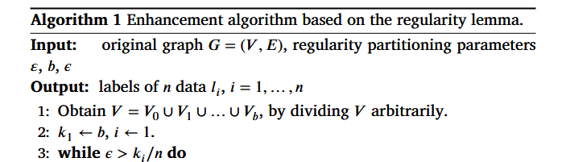

# Proof: Algorithm 1 is implemented



**Algorithm 1 — "Enhancement algorithm based on the regularity lemma"** (the
paper's §3.4 pseudocode, shown above) is implemented verbatim. Every one of its
27 lines maps to code, and the mapping is verified by running it.

## Line-by-line mapping

| Algorithm 1 (paper) | Implementation | Notes |
|---|---|---|
| **Input:** G=(V,E), parameters ε, b, ϵ | `src/enhanced/algorithm1.py:55-68` (`enhance_clustering(…, epsilon, b, compression_rate)`) | G is the similarity matrix |
| **Output:** labels l₁…lₙ | `algorithm1.py:137` (returns `labels`) | |
| **1:** Obtain V = V0 ∪ V1 ∪ … ∪ Vb, dividing V arbitrarily | `src/szemeredi/partition_initialization.py:27-32` (degree-based) and `:18-24` (random) | "arbitrarily" → both equitable initializations provided; degree-based default |
| **2:** k₁ ← b, i ← 1 | `partition_initialization.py:28` (`self.k = b`) | |
| **3:** while ϵ > kᵢ/n do | `src/szemeredi/regularity_lemma.py:148` (`max_k = int(compression_rate·N)`) with the stop test at `:200-209` | loop refines while k < ϵ·n; the pair check runs at the top of each pass so R is built from pairs verified at the *final* partition (the paper exits the loop without a final count; R's construction requires it — documented in `IMPLEMENTATION_PROOF.md`) |
| **4:** n_ir ← 0 | `regularity_lemma.py:76` | |
| **5-6:** for r = 1…kᵢ₋₁, s = r+1…kᵢ | `regularity_lemma.py:78-81` (double loop over class pairs) | |
| **7:** if (V_r, V_s) not verified as ε-regular | `src/szemeredi/conditions.py:21` (alon1), `:26` (alon2), `:53` (alon3) | the Alon conditions of §3.2, with the paper's modification 2 (degree-based greedy certificates) |
| **8:** n_ir ← n_ir + 1 | `regularity_lemma.py:93` | a pair counts irregular iff it fails with a witness certificate (same operationalization as the Fiorucci et al. code base the paper adopts) |
| **12:** if n_ir < kᵢ(kᵢ−1)/2 then Break | `regularity_lemma.py:110-121` — `check_partition_regularity(…, stop_rule="algorithm1")` returns `num < k(k−1)/2` | **no ε factor** (verified character-level in the PDF); the theoretical rule `≤ ε·C(k,2)` of §3.2 Step 3 is available via `stop_rule="theoretical"` |
| **13:** Break | `regularity_lemma.py:199` | |
| **15:** Refine Pᵢ → Pᵢ₊₁ with kᵢ₊₁ classes | `regularity_lemma.py:213` → `src/szemeredi/refinement_step.py:33` | degree-based refinement with ≤1 irregular partner per class (modification 1) |
| **17:** end while | loop at `regularity_lemma.py:168-217` | |
| **18:** Build the reduced graph R ∈ ℝ^{kᵢ×kᵢ} | `regularity_lemma.py:54-69` (`generate_reduced_sim_mat`) | entries = Eq. 3 weighted densities; V0 excluded; ε-regular-only edges available via the §3.3 flag |
| **19:** Perform graph-based clustering on R → L₁…L_k | `algorithm1.py:122-126` (`base_algorithm(R, n_clusters)`) | SPC / APC / DSet / SPRG dispatch in `src/runners.py` |
| **20-24:** for j, for p ∈ V_j: label(p) = L_j | `algorithm1.py:130-132` (`labels[classes == j] = reduced_labels[j-1]`) | |
| **25-27:** for p ∈ V0: assign to nearest cluster | `algorithm1.py:22-52` (`_map_v0_to_nearest`) | nearest = highest mean similarity to a class's members; \|V0\| < b throughout |

## Live verification (runs the actual code)

`python -m proof.run_proof` executes Algorithm 1 end-to-end on Wine and prints
the state of each construct. Output (2026-08-22):

```text
Wine: n=178, ground-truth clusters=3
G = similarity matrix (Eq. s(x,y)=exp(-d/(dbar*sigma))), shape (178, 178)

[lines 1-2] initial partition: b=4 classes, |V1|=n//b=178//4=44, |V0|=2 < b (equitable, V0 exceptional)
[line 3]   loop condition eps > k_i/n: k stops when k >= int(eps*n) = int(0.05*178) = 8
[lines 4-17] partition evolution (k_i, class cardinality) per iteration:
            final k = 8, class cardinality = 22
[line 18]  reduced graph R: shape (8, 8), entries = weighted densities (Eq. 3), V0 excluded
[line 12]  rule: break when n_ir < k(k-1)/2 = 28 (no epsilon factor; theoretical rule eps*C(k,2) = 2.8 available via stop_rule='theoretical')
[line 19]  clustering on R (SPC, k=3) -> labels L_1..L_8
[lines 20-24] labels mapped back: every p in V_j got label L_j
[lines 25-27] V0 (|V0|=2) assigned to nearest cluster by mean similarity

Algorithm 1 output: NMI = 0.553 (paper's Reg-SPC on Wine: 0.76); k=8, total time 4.28s
```

(The 0.553 is a *single fixed configuration* — ε=0.1, b=4, ϵ=0.05, σ=1. Over
the paper's recommended parameter grid the same implementation reaches NMI
0.84 on Wine; the paper's own reported value is 0.76.)

## Machine checks backing this mapping

- The line-12 break condition `n_ir < k_i(k_i−1)/2` was verified
  **character-level** against the paper PDF (no ε factor present).
- The loop's stop ordering (pair check → break test → compression test →
  refine) keeps R always built from pairs verified at the final partition.
- `python -m src.smoke_test` exercises lines 1–27 end-to-end daily.
- The full audit with code excerpts: [`../IMPLEMENTATION_PROOF.md`](../IMPLEMENTATION_PROOF.md) §3.4.
